= eCommerce Application

Author:- Suresh Thomas

:icons: font

[TIP]

Please click on details link > below each section to collapse that part of doc

== 1.0  Organisation of the code

This report is the high level write-up of submission by Suresh Thomas. This aim is to demonstrate
the learning of key security and DevOps skills from this course. The specific concerns addressed here are

[%collapsible]
====

[square]
* Demonstrate correct handling of authorization with proper security using JWT.  The https://en.wikipedia.org/wiki/Bcrypt[BCrypt] encryption of password and JWT security based on https://auth0.com/blog/implementing-jwt-authentication-on-spring-boot/[auth0] is implemented
* Write tests and meet an acceptable code coverage level. Junit 4.7 is used with https://www.eclemma.org/jacoco/[JaCoCo] code coverage libraries
* Identify the correct metrics for logging, in order to monitor a system.
* Index metrics to Splunk.
* Demonstrate configuration and automation of the CI/CD pipeline.
* Managing using git, branching , pull requests. Also using Git practices such as .gitignore &amp; branching
* Building and deploying docker images
* Deploying on Apache tomcat 9

====
== 2.0 Code

The original template is written in Java using Spring Boot, Hibernate ORM, and the H2 database. The following changes have been made to the original template

[%collapsible]
====

* Instead of continue using outdated(still commercially supported) Java 8, the project has been upgraded to java 11
* Replaced the springboot  logging with log4j2. Instead of using sl4j wrapper, the log4J provides its own APIs
* Swagger has been added , whitelisted the endpoint URL - http://localhost:9999/udacity/swagger-ui.html#/ so that it can be accessed
* https://www.eclemma.org/jacoco/[jacoco] has been added to Junit test coverage reporting
* https://fabric8.io/[Fabric8]'s docker maven https://github.com/fabric8io/docker-maven-plugin[plugin] has been added to create container image as well as run the containers in the Jenkins CD

====

=== 2.1 Organisation of the code

The code has been refactored to add a service layer . So Once the project is set up, you will see 5 packages:

[%collapsible]
====

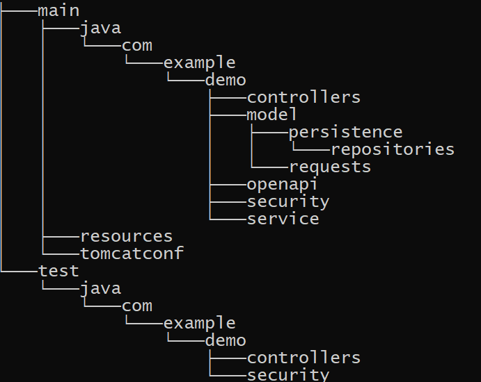

* demo - this package contains the main method which runs the application

* model.persistence - this package contains the data models that Hibernate persists to H2. There are 4 models: Cart, for holding a User's items; Item , for defining new items; User, to hold user account information; and UserOrder, to hold information about submitted orders. Looking back at the application “demo” class, you'll see the `@EntityScan` annotation, telling Spring that this package contains our data models

* model.persistence.repositories - these contain a `JpaRepository` interface for each of our models. This allows Hibernate to connect them with our database so we can access data in the code, as well as define certain convenience methods. Look through them and see the methods that have been declared. Looking at the application “demo” class, you’ll see the `@EnableJpaRepositories` annotation, telling Spring that this package contains our data repositories.

* openapi - this holds swagger related configs

* service

The interaction between controllers and repositories are seperated through a layer of services as per the MVC recommended practcies.

* model.requests - this package contains the request models. The request models will be transformed by Jackson from JSON to these models as requests are made. Note the `Json` annotations, telling Jackson to include and ignore certain fields of the requests. You can also see these annotations on the models themselves.

* controllers - these contain the api endpoints for our app, 1 per model. Note they all have the `@RestController` annotation to allow Spring to understand that they are a part of a REST API

* *_New_*  openapi  This is where swagger.io configurations are stored

* Security

The security has 4 classes

|===
|No |Class Name |Purpose

|1
|JWTAuthenticationFilter
|This  is an implementation of UsernamePasswordAuthenticationFilter. This authenticates the users including all pre and post authentication tasks

|2
|JWTAuthorizationFilter
|This class implements filter chains which query for JWT  token in the header (Bearer). This also checks whether the subject of the token actually represents the user

|3
|WebSecurityConfig
|Its an implementation of WebSecurityConfigurerAdapter configure login
|===

In resources, you'll see the application configuration that sets up our database and Hibernate, It also contains a data.sql file with a couple of items to populate the database with. Spring will run this file every time the application starts. A few API execution examples below

====

=== 2.2 Examples
In this section a few example APIs are provides

[%collapsible]
====
The API examples

****  2.2.1 Create User

http://localhost:8080/api/user/create

----
{
    "username": "usertest",
    "password" : "pass12345678",
    "confirmPassword": "pass12345678"
}

----

and this would return

----
{
    "id": 2,
    "username": "usertest"
}
----

The Login endpoint is controlled by JWT
----
POST /login 
{
    "username": "test",
    "password": "somepassword"
}
----
The following APIs are white lised . The /api endpoint to is for healthcheck
----
GET http://localhost:8080/api
----
You can browse all items and specific item without worrying about login
----
GET http://localhost:8080/api/item/
----
----
GET http://localhost:8080/api/item/1
----
Additionally, Swagger endpoints are white listed
----
/v2/api-docs",
"/configuration/ui",
"/swagger-ui.html"
----

All other endpoints needs authentication

and that should, if those are valid credentials, return a 200 OK with an Authorization header which looks like "Bearer <data>" this "Bearer <data>" is a JWT and must be sent as a Authorization header for all other rqeuests. If it's not present, endpoints should return 401 Unauthorized. If it's present and valid, the endpoints should function as normal.

====

== 3.0 Testing
There are 21 test cases been created to assure 92% coverage as shown below
[%collapsible]
====

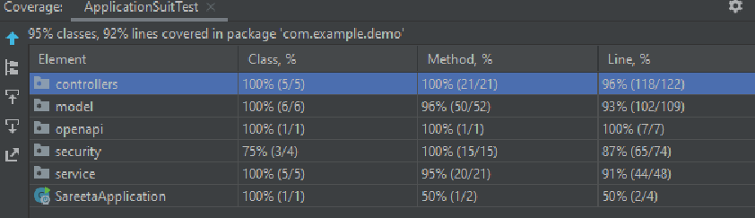

This has been organised under a test suit . Can be executed to through maven goals such _test_ , _verify_ etc

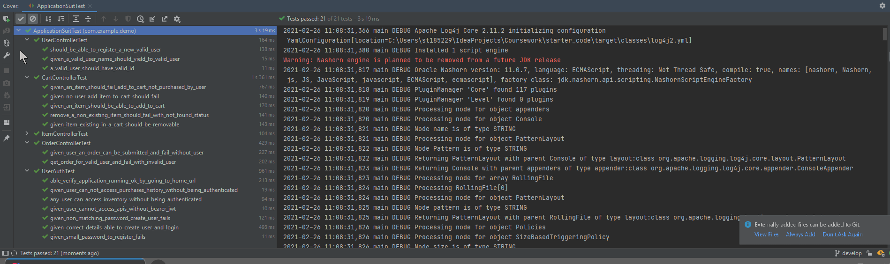

====

== 4.0 Docker
[%collapsible]
====

A maven plugin https://github.com/fabric8io/docker-maven-plugin[fabric8] is used to create and run docker images
----
<groupId>io.fabric8</groupId>
<artifactId>docker-maven-plugin</artifactId>
----
See the POM file for details.
The dockerfile is below
----
# we are extending everything from tomcat:9.0 image ...
FROM tomcat:9.0.43-jdk11-openjdk
MAINTAINER Suresh Thomas
EXPOSE 8080
# COPY path-to-your-application-war path-to-webapps-in-docker-tomcat
ADD target/${project.artifactId}.war /usr/local/tomcat/webapps/udacity.war
CMD ["catalina.sh","run"]
----
**** Build the docker file from Maven
----
mvn docker:build
----
**** Run the docker file
----
docker run -p 9999:8080 auth-course:0.0.1.0
----
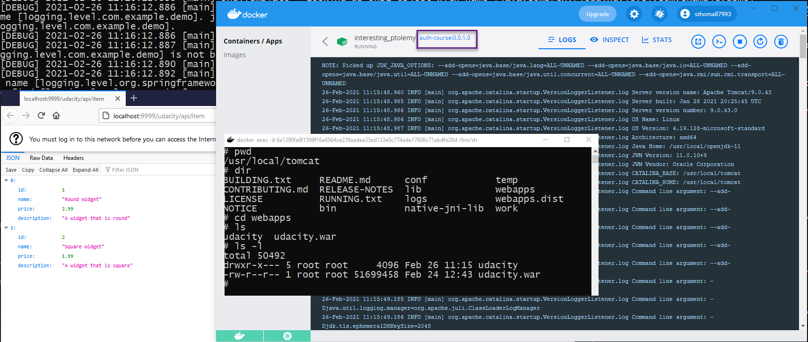

====

== 5.0 Git process
All development work is done a dev branch, the code is committed and pushed to dev. The merge of code into master/main is done through pull request(PR). A .ignore file removes build, log and IDE files.

== 6.0 Metrics dashboard and Alerts

=== 6.1 Log4J configuration

[%collapsible]
====

POM file, the below dependencies are added
----
<dependency>
            <groupId>org.projectlombok</groupId>
            <artifactId>lombok</artifactId>
        </dependency>
        <dependency>
            <groupId>org.springframework.boot</groupId>
            <artifactId>spring-boot-starter-log4j2</artifactId>
            <version>2.1.5.RELEASE</version>
        </dependency>
----
Examples of annotations on classes and statements. The annotation has dependency on lombok , but it takes away the boiler-plate code to declare logger in each class
----
@RestController
@Log4j2
@RequestMapping("/api/cart")
public class OrderController {
    private final UserService userSer
..
..
..
log.info("A order has been created successfully with  id={} for the user ={} with total of {}",
                order.getId(), order.getUser(), order.getTotal());
..
..
----
The log4 j pattern used here below
----
  Pattern: "[%-5level] %d{yyyy-MM-dd HH:mm:ss.SSS} [%t] %c{1} - %msg%n"
----

====

=== 6.2 Splunk
The Splunk Enterprise  Version:8.0.6 trial version is used for search and reporting of application logs
A single index,  _udacity_ is created and all files are loaded to the index. No forwarders or receivers are used here.The  correct metrics to log been identified, to monitor the system and Index metrics to Splunk.  A few screenshots and logs below under details

[%collapsible]
====

**** 1. CreateUser request successes

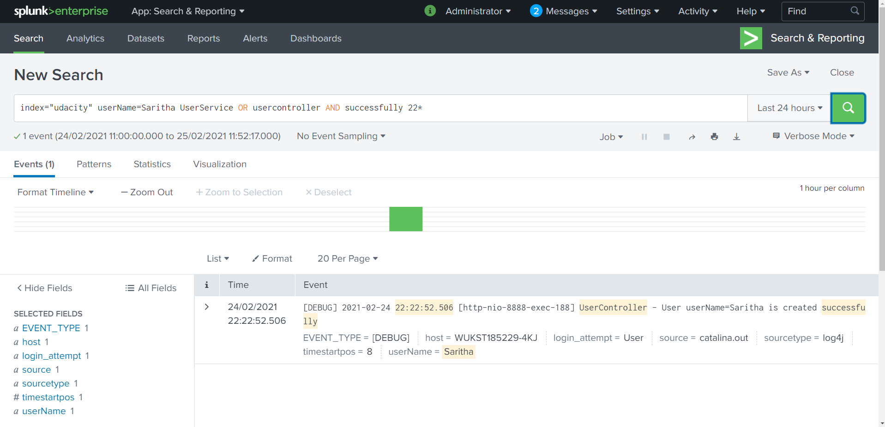

Another example below

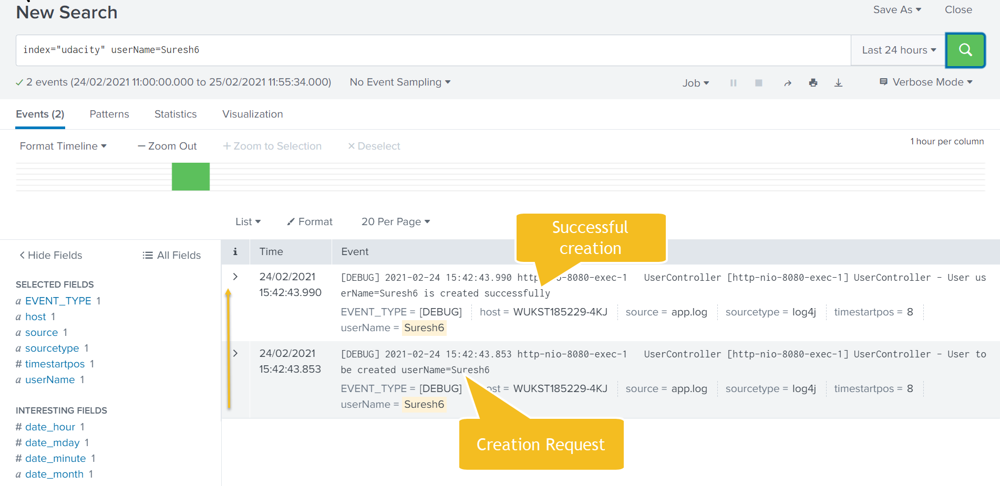

**** 2. CreateUser request fails
The below image shows failure of use creation due to password length

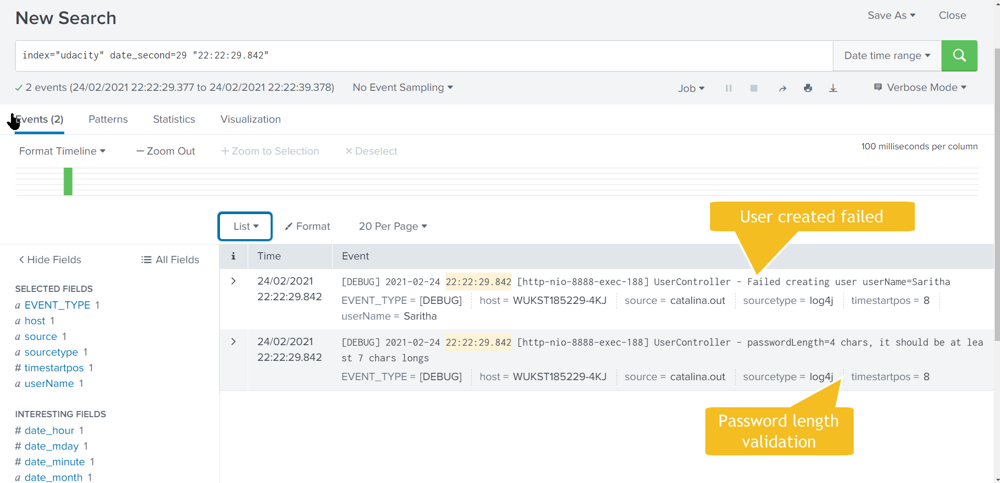

**** 3. Exceptions
The below images shows an exception query

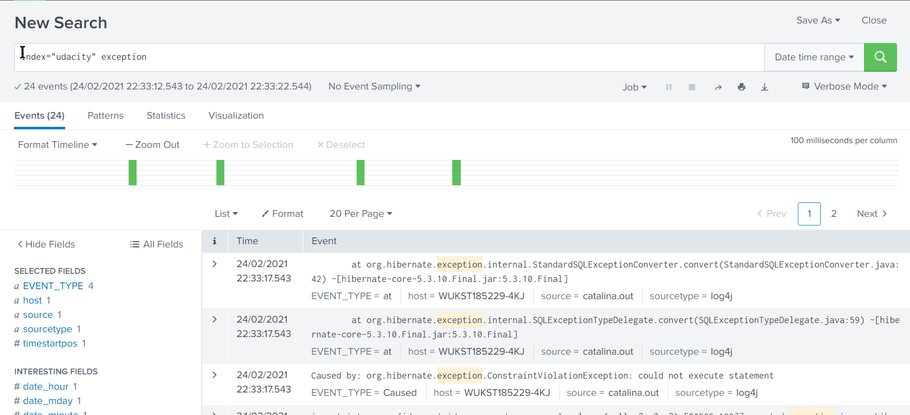

All errors and debug messages below

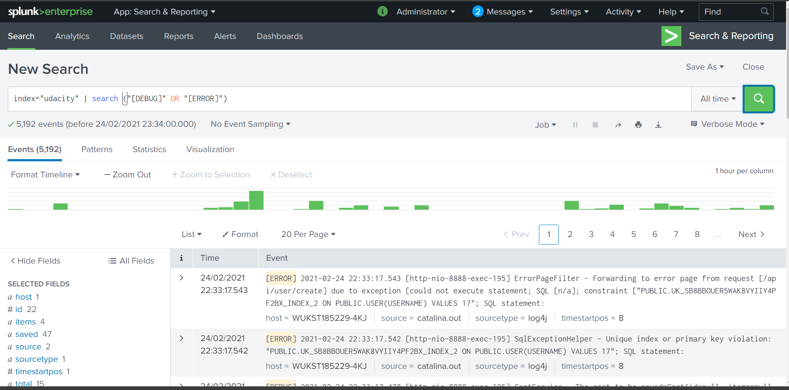

**** 3.1 Other docs

link:splunk_reports/all_events-2021-02-24_withIndexUdacity.pdf[All Events]

link:splunk_reports/Errorsinlast24hoursHTMLSplunk.pdf[Errors in last 24 hrs]

link:splunk_reports/Exceptionsinthelast4hours.pdf[Exceptions in the last 4 hrs]

**** 4. Order request success

link:splunk_reports/Order_success.pdf[ Order success]

**** 5. Order Failure

link:splunk_reports/OrderFailure.pdf[Order failure]

**** 5.bOrder progress reports

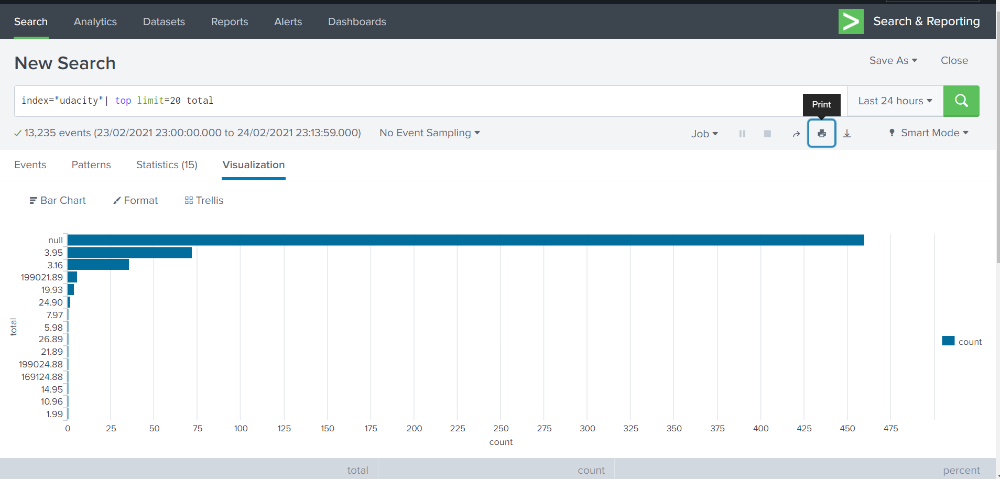

**** 6. Alerts and Dashboards
***** Alerts

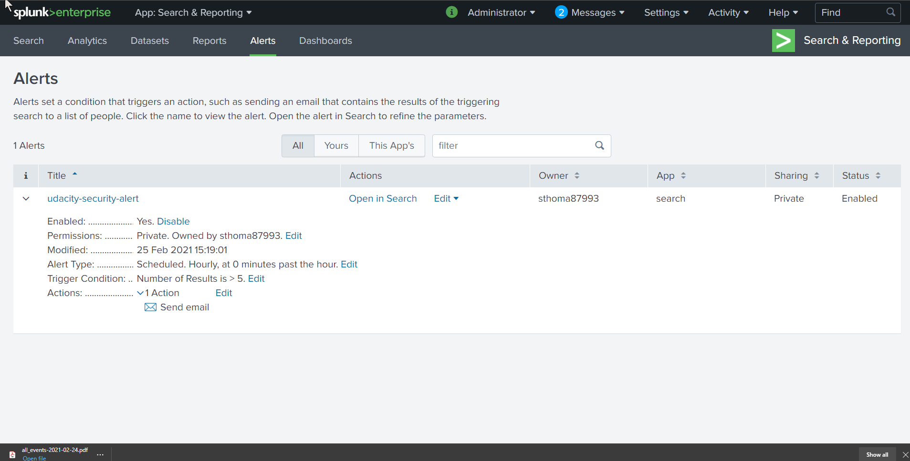

***** Alert setup

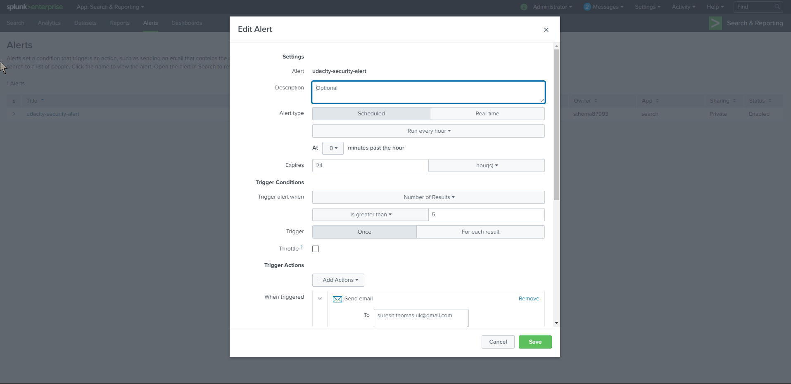

***** Dashboards
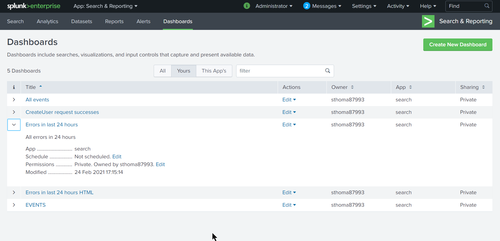

====

== 7.0 CI/CD
The details of Jenkins implementation below

=== 7.1 Implementation details

[%collapsible]
====

The below shows the Jenkins project home page

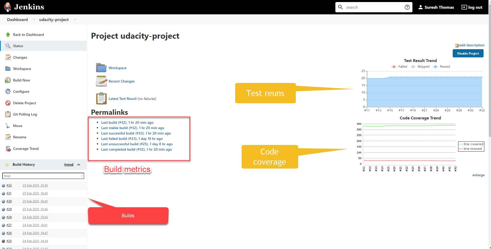

The below shows the code coverage during Jenkins CI (test goal of maven)

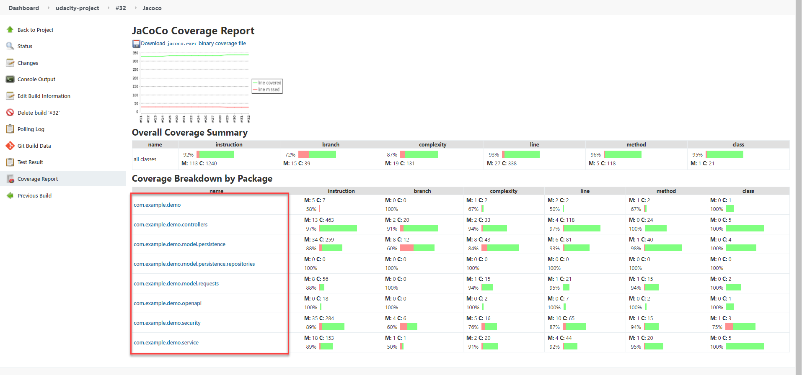

Jenkins setup page 1

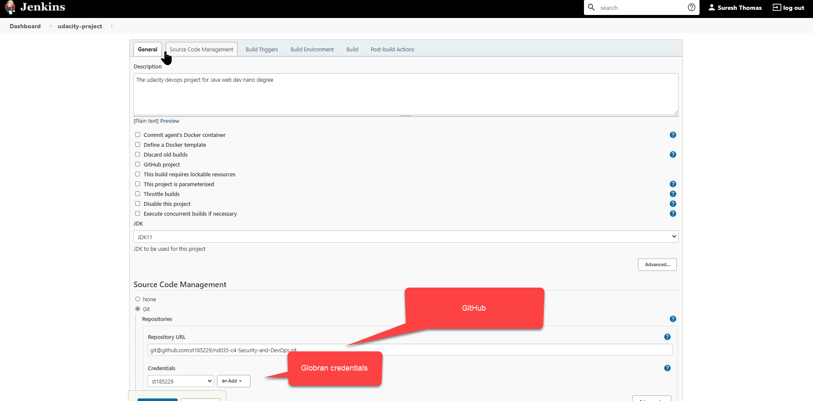

Source code Management

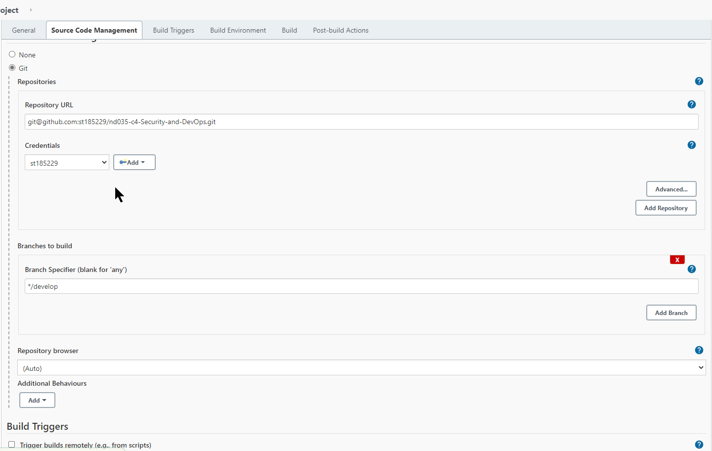

Build Triggers

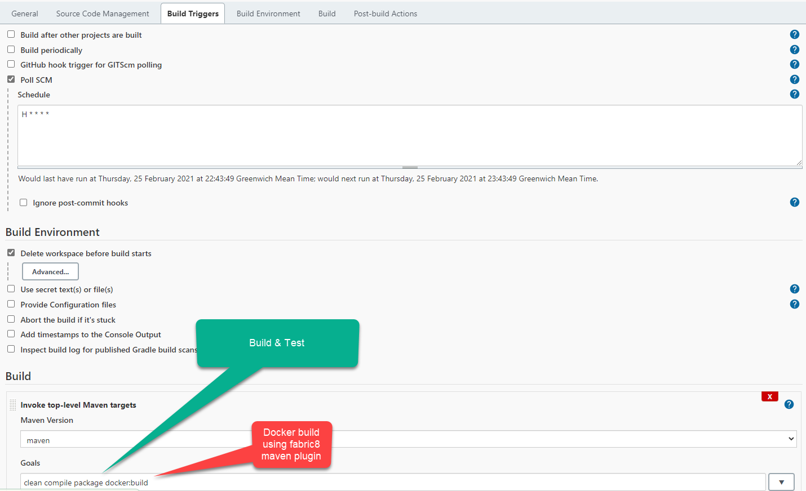

Build Env

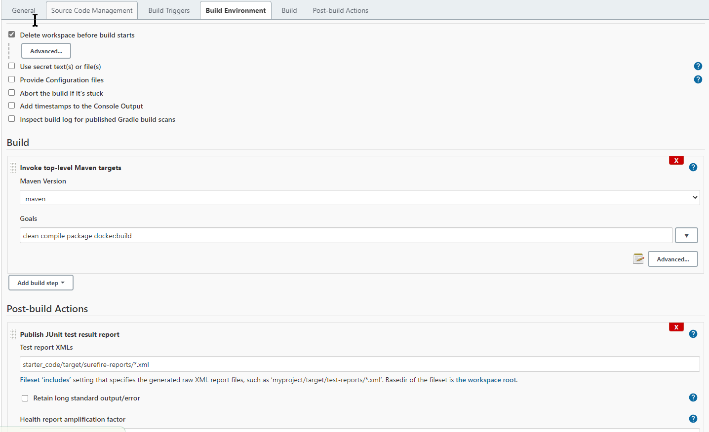

Build & Code coverage

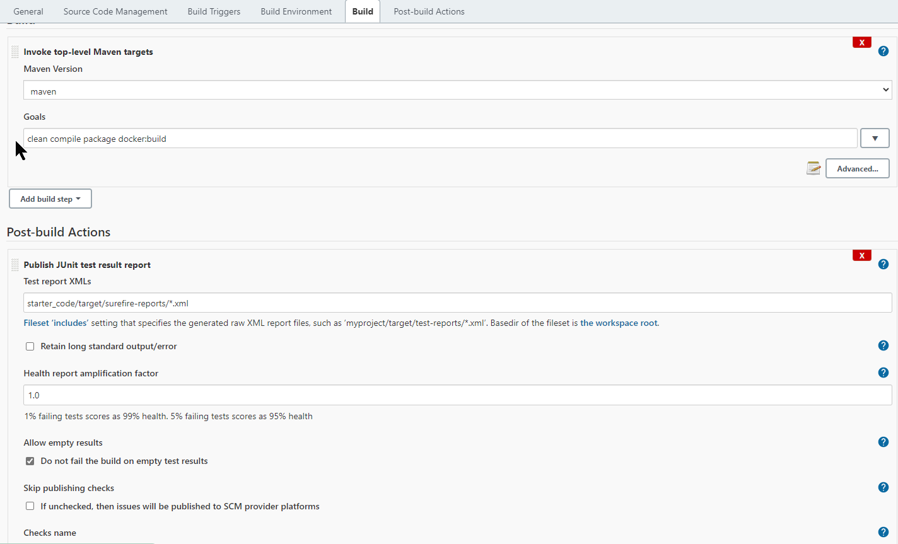

Post build action and deployment

image::splunk_reports/PostBuild.png

Deployed Application

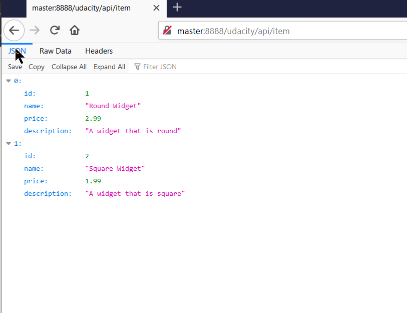

Build Log high level

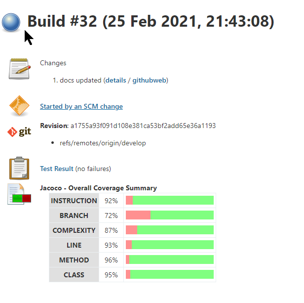

====

=== 7.2 Build Log

[%collapsible]
====
----
Started by an SCM change
Running as SYSTEM
Building in workspace /var/lib/jenkins/workspace/udacity-project
[WS-CLEANUP] Deleting project workspace...
[WS-CLEANUP] Deferred wipeout is used...
[WS-CLEANUP] Done
The recommended git tool is: NONE
using credential 8cde9480-1ab7-4e98-8271-220298cd3550
Cloning the remote Git repository
Cloning repository git@github.com:st185229/nd035-c4-Security-and-DevOps.git
 > git init /var/lib/jenkins/workspace/udacity-project # timeout=10
Fetching upstream changes from git@github.com:st185229/nd035-c4-Security-and-DevOps.git
 > git --version # timeout=10
 > git --version # 'git version 2.27.0'
using GIT_SSH to set credentials
 > git fetch --tags --force --progress -- git@github.com:st185229/nd035-c4-Security-and-DevOps.git +refs/heads/*:refs/remotes/origin/* # timeout=10
 > git config remote.origin.url git@github.com:st185229/nd035-c4-Security-and-DevOps.git # timeout=10
 > git config --add remote.origin.fetch +refs/heads/*:refs/remotes/origin/* # timeout=10
Avoid second fetch
 > git rev-parse refs/remotes/origin/develop^{commit} # timeout=10
Checking out Revision a1755a93f091d108e381ca53bf2add65e36a1193 (refs/remotes/origin/develop)
 > git config core.sparsecheckout # timeout=10
 > git checkout -f a1755a93f091d108e381ca53bf2add65e36a1193 # timeout=10
Commit message: "docs updated"
 > git rev-list --no-walk d9554a968fa87fe2dd9f5be5cf26092387bd022c # timeout=10
[udacity-project] $ /var/lib/jenkins/tools/hudson.tasks.Maven_MavenInstallation/maven/bin/mvn -f starter_code/pom.xml clean compile package docker:build
[INFO] Scanning for projects...
[INFO]
[INFO] ----------------------< com.example:auth-course >-----------------------
[INFO] Building auth-course 0.0.1-SNAPSHOT
[INFO] --------------------------------[ war ]---------------------------------
[INFO]
[INFO] --- maven-clean-plugin:3.1.0:clean (default-clean) @ auth-course ---
[INFO]
[INFO] --- jacoco-maven-plugin:0.8.2:prepare-agent (default) @ auth-course ---
[INFO] argLine set to -javaagent:/var/lib/jenkins/.m2/repository/org/jacoco/org.jacoco.agent/0.8.2/org.jacoco.agent-0.8.2-runtime.jar=destfile=/var/lib/jenkins/workspace/udacity-project/starter_code/target/jacoco.exec
[INFO]
[INFO] --- maven-resources-plugin:3.1.0:resources (default-resources) @ auth-course ---
[INFO] Using 'UTF-8' encoding to copy filtered resources.
[INFO] Copying 1 resource
[INFO] Copying 2 resources
[INFO]
[INFO] --- maven-compiler-plugin:3.8.1:compile (default-compile) @ auth-course ---
[INFO] Changes detected - recompiling the module!
[INFO] Compiling 26 source files to /var/lib/jenkins/workspace/udacity-project/starter_code/target/classes
[INFO]
[INFO] --- jacoco-maven-plugin:0.8.2:prepare-agent (default) @ auth-course ---
[INFO] argLine set to -javaagent:/var/lib/jenkins/.m2/repository/org/jacoco/org.jacoco.agent/0.8.2/org.jacoco.agent-0.8.2-runtime.jar=destfile=/var/lib/jenkins/workspace/udacity-project/starter_code/target/jacoco.exec
[INFO]
[INFO] --- maven-resources-plugin:3.1.0:resources (default-resources) @ auth-course ---
[INFO] Using 'UTF-8' encoding to copy filtered resources.
[INFO] Copying 1 resource
[INFO] Copying 2 resources
[INFO]
[INFO] --- maven-compiler-plugin:3.8.1:compile (default-compile) @ auth-course ---
[INFO] Changes detected - recompiling the module!
[INFO] Compiling 26 source files to /var/lib/jenkins/workspace/udacity-project/starter_code/target/classes
[INFO]
[INFO] --- maven-resources-plugin:3.1.0:testResources (default-testResources) @ auth-course ---
[INFO] Using 'UTF-8' encoding to copy filtered resources.
[INFO] skip non existing resourceDirectory /var/lib/jenkins/workspace/udacity-project/starter_code/src/test/resources
[INFO]
[INFO] --- maven-compiler-plugin:3.8.1:testCompile (default-testCompile) @ auth-course ---
[INFO] Changes detected - recompiling the module!
[INFO] Compiling 6 source files to /var/lib/jenkins/workspace/udacity-project/starter_code/target/test-classes
[INFO] /var/lib/jenkins/workspace/udacity-project/starter_code/src/test/java/com/example/demo/controllers/ItemControllerTest.java: /var/lib/jenkins/workspace/udacity-project/starter_code/src/test/java/com/example/demo/controllers/ItemControllerTest.java uses unchecked or unsafe operations.
[INFO] /var/lib/jenkins/workspace/udacity-project/starter_code/src/test/java/com/example/demo/controllers/ItemControllerTest.java: Recompile with -Xlint:unchecked for details.
[INFO]
[INFO] --- maven-surefire-plugin:3.0.0-M5:test (default-test) @ auth-course ---
[INFO]
[INFO] -------------------------------------------------------
[INFO]  T E S T S
[INFO] -------------------------------------------------------
2021-02-25 21:43:15,849 main DEBUG Apache Log4j Core 2.11.2 initializing configuration YamlConfiguration[location=/var/lib/jenkins/workspace/udacity-project/starter_code/target/classes/log4j2.yml]
2021-02-25 21:43:15,860 main DEBUG Installed 1 script engine
Warning: Nashorn engine is planned to be removed from a future JDK release
2021-02-25 21:43:16,186 main DEBUG Oracle Nashorn version: 11.0.10, language: ECMAScript, threading: Not Thread Safe, compile: true, names: [nashorn, Nashorn, js, JS, JavaScript, javascript, ECMAScript, ecmascript], factory class: jdk.nashorn.api.scripting.NashornScriptEngineFactory
2021-02-25 21:43:16,186 main DEBUG PluginManager 'Core' found 117 plugins
2021-02-25 21:43:16,187 main DEBUG PluginManager 'Level' found 0 plugins
2021-02-25 21:43:16,187 main DEBUG Processing node for object appenders
2021-02-25 21:43:16,187 main DEBUG Processing node for object Console
2021-02-25 21:43:16,187 main DEBUG Node name is of type STRING
2021-02-25 21:43:16,187 main DEBUG Processing node for object PatternLayout
2021-02-25 21:43:16,188 main DEBUG Node Pattern is of type STRING
2021-02-25 21:43:16,188 main DEBUG Returning PatternLayout with parent Console of type layout:class org.apache.logging.log4j.core.layout.PatternLayout
2021-02-25 21:43:16,188 main DEBUG Returning Console with parent appenders of type appender:class org.apache.logging.log4j.core.appender.ConsoleAppender
2021-02-25 21:43:16,188 main DEBUG Processing node for array RollingFile
2021-02-25 21:43:16,189 main DEBUG Processing RollingFile[0]
2021-02-25 21:43:16,189 main DEBUG Processing node for object PatternLayout
2021-02-25 21:43:16,189 main DEBUG Node pattern is of type STRING
2021-02-25 21:43:16,189 main DEBUG Returning PatternLayout with parent RollingFile of type layout:class org.apache.logging.log4j.core.layout.PatternLayout
2021-02-25 21:43:16,190 main DEBUG Processing node for object Policies
2021-02-25 21:43:16,190 main DEBUG Processing node for object SizeBasedTriggeringPolicy
2021-02-25 21:43:16,190 main DEBUG Node size is of type STRING
2021-02-25 21:43:16,190 main DEBUG Returning SizeBasedTriggeringPolicy with parent Policies of type SizeBasedTriggeringPolicy:class org.apache.logging.log4j.core.appender.rolling.SizeBasedTriggeringPolicy
2021-02-25 21:43:16,191 main DEBUG Returning Policies with parent RollingFile of type Policies:class org.apache.logging.log4j.core.appender.rolling.CompositeTriggeringPolicy
2021-02-25 21:43:16,191 main DEBUG Processing node for object DefaultRollOverStrategy
2021-02-25 21:43:16,193 main DEBUG Node max is of type NUMBER
2021-02-25 21:43:16,193 main DEBUG Returning DefaultRollOverStrategy with parent RollingFile of type DefaultRolloverStrategy:class org.apache.logging.log4j.core.appender.rolling.DefaultRolloverStrategy
2021-02-25 21:43:16,194 main DEBUG Returning appenders with parent root of type appenders:class org.apache.logging.log4j.core.config.AppendersPlugin
2021-02-25 21:43:16,194 main DEBUG Processing node for object Loggers
2021-02-25 21:43:16,194 main DEBUG Processing node for array logger
2021-02-25 21:43:16,194 main DEBUG Processing logger[0]
2021-02-25 21:43:16,194 main DEBUG Processing array for object AppenderRef
2021-02-25 21:43:16,194 main DEBUG Node ref is of type STRING
2021-02-25 21:43:16,195 main DEBUG Returning AppenderRef with parent logger of type AppenderRef:class org.apache.logging.log4j.core.config.AppenderRef
2021-02-25 21:43:16,195 main DEBUG Node ref is of type STRING
2021-02-25 21:43:16,195 main DEBUG Returning AppenderRef with parent logger of type AppenderRef:class org.apache.logging.log4j.core.config.AppenderRef
2021-02-25 21:43:16,195 main DEBUG Processing node for object Root
2021-02-25 21:43:16,195 main DEBUG Node level is of type STRING
2021-02-25 21:43:16,196 main DEBUG Processing node for object AppenderRef
2021-02-25 21:43:16,196 main DEBUG Node ref is of type STRING
2021-02-25 21:43:16,196 main DEBUG Returning AppenderRef with parent Root of type AppenderRef:class org.apache.logging.log4j.core.config.AppenderRef
2021-02-25 21:43:16,196 main DEBUG Returning Root with parent Loggers of type root:class org.apache.logging.log4j.core.config.LoggerConfig$RootLogger
2021-02-25 21:43:16,196 main DEBUG Returning Loggers with parent root of type loggers:class org.apache.logging.log4j.core.config.LoggersPlugin
2021-02-25 21:43:16,197 main DEBUG Completed parsing configuration
2021-02-25 21:43:16,199 main DEBUG PluginManager 'Lookup' found 13 plugins
2021-02-25 21:43:16,201 main DEBUG Building Plugin[name=layout, class=org.apache.logging.log4j.core.layout.PatternLayout].
2021-02-25 21:43:16,212 main DEBUG PluginManager 'TypeConverter' found 26 plugins
2021-02-25 21:43:16,225 main DEBUG PatternLayout$Builder(pattern="[%-5level] %d{yyyy-MM-dd HH:mm:ss.SSS} [%t] %c{1} - %msg%n", PatternSelector=null, Configuration(/var/lib/jenkins/workspace/udacity-project/starter_code/target/classes/log4j2.yml), Replace=null, charset="null", alwaysWriteExceptions="null", disableAnsi="null", noConsoleNoAnsi="null", header="null", footer="null", )
2021-02-25 21:43:16,226 main DEBUG PluginManager 'Converter' found 47 plugins
2021-02-25 21:43:16,240 main DEBUG Building Plugin[name=appender, class=org.apache.logging.log4j.core.appender.ConsoleAppender].
2021-02-25 21:43:16,245 main DEBUG ConsoleAppender$Builder(target="null", follow="null", direct="null", , bufferedIo="null", bufferSize="null", immediateFlush="null", , ignoreExceptions="null", PatternLayout([%-5level] %d{yyyy-MM-dd HH:mm:ss.SSS} [%t] %c{1} - %msg%n), name="LogToConsole", Configuration(/var/lib/jenkins/workspace/udacity-project/starter_code/target/classes/log4j2.yml), , Filter=null, ={}, )
2021-02-25 21:43:16,247 main DEBUG Starting OutputStreamManager SYSTEM_OUT.false.false
2021-02-25 21:43:16,247 main DEBUG Building Plugin[name=layout, class=org.apache.logging.log4j.core.layout.PatternLayout].
2021-02-25 21:43:16,248 main DEBUG PatternLayout$Builder(pattern="[%-5level] %d{yyyy-MM-dd HH:mm:ss.SSS} [%t] %c{1} - %msg%n", PatternSelector=null, Configuration(/var/lib/jenkins/workspace/udacity-project/starter_code/target/classes/log4j2.yml), Replace=null, charset="null", alwaysWriteExceptions="null", disableAnsi="null", noConsoleNoAnsi="null", header="null", footer="null", )
2021-02-25 21:43:16,248 main DEBUG Building Plugin[name=SizeBasedTriggeringPolicy, class=org.apache.logging.log4j.core.appender.rolling.SizeBasedTriggeringPolicy].
2021-02-25 21:43:16,254 main DEBUG createPolicy(size="10MB")
2021-02-25 21:43:16,255 main DEBUG Building Plugin[name=Policies, class=org.apache.logging.log4j.core.appender.rolling.CompositeTriggeringPolicy].
2021-02-25 21:43:16,256 main DEBUG createPolicy(={SizeBasedTriggeringPolicy(size=10485760)})
2021-02-25 21:43:16,256 main DEBUG Building Plugin[name=DefaultRolloverStrategy, class=org.apache.logging.log4j.core.appender.rolling.DefaultRolloverStrategy].
2021-02-25 21:43:16,260 main DEBUG DefaultRolloverStrategy$Builder(max="10", min="null", fileIndex="null", compressionLevel="null", ={}, stopCustomActionsOnError="null", tempCompressedFilePattern="null", Configuration(/var/lib/jenkins/workspace/udacity-project/starter_code/target/classes/log4j2.yml), )
2021-02-25 21:43:16,261 main DEBUG Building Plugin[name=appender, class=org.apache.logging.log4j.core.appender.RollingFileAppender].
2021-02-25 21:43:16,263 main DEBUG RollingFileAppender$Builder(fileName="logs/app.log", filePattern="logs/${date:yyyy-MM}/app-%d{MM-dd-yyyy}-%i.log.gz", append="null", locking="null", Policies(CompositeTriggeringPolicy(policies=[SizeBasedTriggeringPolicy(size=10485760)])), DefaultRollOverStrategy(DefaultRolloverStrategy(min=1, max=10, useMax=true)), advertise="null", advertiseUri="null", createOnDemand="null", filePermissions="null", fileOwner="null", fileGroup="null", , bufferedIo="null", bufferSize="null", immediateFlush="null", , ignoreExceptions="null", PatternLayout([%-5level] %d{yyyy-MM-dd HH:mm:ss.SSS} [%t] %c{1} - %msg%n), name="LogToRollingFile", Configuration(/var/lib/jenkins/workspace/udacity-project/starter_code/target/classes/log4j2.yml), , Filter=null, ={}, )
2021-02-25 21:43:16,268 main DEBUG Returning file creation time for /var/lib/jenkins/workspace/udacity-project/starter_code/logs/app.log
2021-02-25 21:43:16,268 main DEBUG Starting RollingFileManager logs/app.log
2021-02-25 21:43:16,270 main DEBUG PluginManager 'FileConverter' found 2 plugins
2021-02-25 21:43:16,272 main DEBUG Setting prev file time to 2021-02-25T21:43:16.262+0000
2021-02-25 21:43:16,274 main DEBUG Initializing triggering policy CompositeTriggeringPolicy(policies=[SizeBasedTriggeringPolicy(size=10485760)])
2021-02-25 21:43:16,274 main DEBUG Initializing triggering policy SizeBasedTriggeringPolicy(size=10485760)
2021-02-25 21:43:16,274 main DEBUG Building Plugin[name=appenders, class=org.apache.logging.log4j.core.config.AppendersPlugin].
2021-02-25 21:43:16,274 main DEBUG createAppenders(={LogToConsole, LogToRollingFile})
2021-02-25 21:43:16,275 main DEBUG Building Plugin[name=AppenderRef, class=org.apache.logging.log4j.core.config.AppenderRef].
2021-02-25 21:43:16,275 main DEBUG createAppenderRef(ref="LogToConsole", level="null", Filter=null)
2021-02-25 21:43:16,275 main DEBUG Building Plugin[name=AppenderRef, class=org.apache.logging.log4j.core.config.AppenderRef].
2021-02-25 21:43:16,276 main DEBUG createAppenderRef(ref="LogToRollingFile", level="null", Filter=null)
2021-02-25 21:43:16,276 main DEBUG Building Plugin[name=logger, class=org.apache.logging.log4j.core.config.LoggerConfig].
2021-02-25 21:43:16,277 main DEBUG createLogger(additivity="false", level="DEBUG", name="com.example.demo", includeLocation="null", ={LogToConsole, LogToRollingFile}, ={}, Configuration(/var/lib/jenkins/workspace/udacity-project/starter_code/target/classes/log4j2.yml), Filter=null)
2021-02-25 21:43:16,279 main DEBUG Building Plugin[name=AppenderRef, class=org.apache.logging.log4j.core.config.AppenderRef].
2021-02-25 21:43:16,280 main DEBUG createAppenderRef(ref="LogToConsole", level="null", Filter=null)
2021-02-25 21:43:16,280 main DEBUG Building Plugin[name=root, class=org.apache.logging.log4j.core.config.LoggerConfig$RootLogger].
2021-02-25 21:43:16,280 main DEBUG createLogger(additivity="null", level="DEBUG", includeLocation="null", ={LogToConsole}, ={}, Configuration(/var/lib/jenkins/workspace/udacity-project/starter_code/target/classes/log4j2.yml), Filter=null)
2021-02-25 21:43:16,281 main DEBUG Building Plugin[name=loggers, class=org.apache.logging.log4j.core.config.LoggersPlugin].
2021-02-25 21:43:16,282 main DEBUG createLoggers(={com.example.demo, root})
2021-02-25 21:43:16,283 main DEBUG Configuration YamlConfiguration[location=/var/lib/jenkins/workspace/udacity-project/starter_code/target/classes/log4j2.yml] initialized
2021-02-25 21:43:16,283 main DEBUG Starting configuration YamlConfiguration[location=/var/lib/jenkins/workspace/udacity-project/starter_code/target/classes/log4j2.yml]
2021-02-25 21:43:16,283 main DEBUG Started configuration YamlConfiguration[location=/var/lib/jenkins/workspace/udacity-project/starter_code/target/classes/log4j2.yml] OK.
2021-02-25 21:43:16,284 main DEBUG Shutting down OutputStreamManager SYSTEM_OUT.false.false-1
2021-02-25 21:43:16,284 main DEBUG Shut down OutputStreamManager SYSTEM_OUT.false.false-1, all resources released: true
2021-02-25 21:43:16,284 main DEBUG Appender DefaultConsole-1 stopped with status true
2021-02-25 21:43:16,284 main DEBUG Stopped org.apache.logging.log4j.core.config.DefaultConfiguration@15923407 OK
2021-02-25 21:43:16,328 main DEBUG Registering MBean org.apache.logging.log4j2:type=3d4eac69
2021-02-25 21:43:16,330 main DEBUG Registering MBean org.apache.logging.log4j2:type=3d4eac69,component=StatusLogger
2021-02-25 21:43:16,332 main DEBUG Registering MBean org.apache.logging.log4j2:type=3d4eac69,component=ContextSelector
2021-02-25 21:43:16,333 main DEBUG Registering MBean org.apache.logging.log4j2:type=3d4eac69,component=Loggers,name=
2021-02-25 21:43:16,334 main DEBUG Registering MBean org.apache.logging.log4j2:type=3d4eac69,component=Loggers,name=com.example.demo
2021-02-25 21:43:16,335 main DEBUG Registering MBean org.apache.logging.log4j2:type=3d4eac69,component=Appenders,name=LogToConsole
2021-02-25 21:43:16,335 main DEBUG Registering MBean org.apache.logging.log4j2:type=3d4eac69,component=Appenders,name=LogToRollingFile
2021-02-25 21:43:16,339 main DEBUG org.apache.logging.log4j.core.util.SystemClock supports precise timestamps.
2021-02-25 21:43:16,340 main DEBUG Reconfiguration complete for context[name=3d4eac69] at URI /var/lib/jenkins/workspace/udacity-project/starter_code/target/classes/log4j2.yml (org.apache.logging.log4j.core.LoggerContext@4039d109) with optional ClassLoader: null
2021-02-25 21:43:16,340 main DEBUG Shutdown hook enabled. Registering a new one.
2021-02-25 21:43:16,340 main DEBUG LoggerContext[name=3d4eac69, org.apache.logging.log4j.core.LoggerContext@4039d109] started OK.
[DEBUG] 2021-02-25 21:43:16.411 [main] SpringJUnit4ClassRunner - SpringJUnit4ClassRunner constructor called with [class com.example.demo.controllers.UserControllerTest]
2021-02-25 21:43:16,417 main DEBUG AsyncLogger.ThreadNameStrategy=UNCACHED (user specified null, default is UNCACHED)
2021-02-25 21:43:16,417 main DEBUG org.apache.logging.log4j.core.util.SystemClock supports precise timestamps.
[DEBUG] 2021-02-25 21:43:16.420 [main] BootstrapUtils - Instantiating CacheAwareContextLoaderDelegate from class [org.springframework.test.context.cache.DefaultCacheAwareContextLoaderDelegate]
[DEBUG] 2021-02-25 21:43:16.431 [main] BootstrapUtils - Instantiating BootstrapContext using constructor [public org.springframework.test.context.support.DefaultBootstrapContext(java.lang.Class,org.springframework.test.context.CacheAwareContextLoaderDelegate)]
[DEBUG] 2021-02-25 21:43:16.451 [main] BootstrapUtils - Instantiating TestContextBootstrapper for test class [com.example.demo.controllers.UserControllerTest] from class [org.springframework.boot.test.context.SpringBootTestContextBootstrapper]
[INFO ] 2021-02-25 21:43:16.464 [main] SpringBootTestContextBootstrapper - Neither @ContextConfiguration nor @ContextHierarchy found for test class [com.example.demo.controllers.UserControllerTest], using SpringBootContextLoader
[DEBUG] 2021-02-25 21:43:16.468 [main] AbstractContextLoader - Did not detect default resource location for test class [com.example.demo.controllers.UserControllerTest]: class path resource [com/example/demo/controllers/UserControllerTest-context.xml] does not exist
[DEBUG] 2021-02-25 21:43:16.469 [main] AbstractContextLoader - Did not detect default resource location for test class [com.example.demo.controllers.UserControllerTest]: class path resource [com/example/demo/controllers/UserControllerTestContext.groovy] does not exist
[INFO ] 2021-02-25 21:43:16.469 [main] AbstractContextLoader - Could not detect default resource locations for test class [com.example.demo.controllers.UserControllerTest]: no resource found for suffixes {-context.xml, Context.groovy}.
[INFO ] 2021-02-25 21:43:16.470 [main] AnnotationConfigContextLoaderUtils - Could not detect default configuration classes for test class [com.example.demo.controllers.UserControllerTest]: UserControllerTest does not declare any static, non-private, non-final, nested classes annotated with @Configuration.
[DEBUG] 2021-02-25 21:43:16.507 [main] ActiveProfilesUtils - Could not find an 'annotation declaring class' for annotation type [org.springframework.test.context.ActiveProfiles] and class [com.example.demo.controllers.UserControllerTest]
[DEBUG] 2021-02-25 21:43:16.618 [main] ClassPathScanningCandidateComponentProvider - Identified candidate component class: file [/var/lib/jenkins/workspace/udacity-project/starter_code/target/classes/com/example/demo/SareetaApplication.class]
[INFO ] 2021-02-25 21:43:16.620 [main] SpringBootTestContextBootstrapper - Found @SpringBootConfiguration com.example.demo.SareetaApplication for test class com.example.demo.controllers.UserControllerTest
[DEBUG] 2021-02-25 21:43:16.706 [main] SpringBootTestContextBootstrapper - @TestExecutionListeners is not present for class [com.example.demo.controllers.UserControllerTest]: using defaults.
[INFO ] 2021-02-25 21:43:16.707 [main] SpringBootTestContextBootstrapper - Loaded default TestExecutionListener class names from location [META-INF/spring.factories]: [org.springframework.boot.test.mock.mockito.MockitoTestExecutionListener, org.springframework.boot.test.mock.mockito.ResetMocksTestExecutionListener, org.springframework.boot.test.autoconfigure.restdocs.RestDocsTestExecutionListener, org.springframework.boot.test.autoconfigure.web.client.MockRestServiceServerResetTestExecutionListener, org.springframework.boot.test.autoconfigure.web.servlet.MockMvcPrintOnlyOnFailureTestExecutionListener, org.springframework.boot.test.autoconfigure.web.servlet.WebDriverTestExecutionListener, org.springframework.test.context.web.ServletTestExecutionListener, org.springframework.test.context.support.DirtiesContextBeforeModesTestExecutionListener, org.springframework.test.context.support.DependencyInjectionTestExecutionListener, org.springframework.test.context.support.DirtiesContextTestExecutionListener, org.springframework.test.context.transaction.TransactionalTestExecutionListener, org.springframework.test.context.jdbc.SqlScriptsTestExecutionListener]
[INFO ] 2021-02-25 21:43:16.724 [main] SpringBootTestContextBootstrapper - Using TestExecutionListeners: [org.springframework.test.context.web.ServletTestExecutionListener@14aa12c5, org.springframework.test.context.support.DirtiesContextBeforeModesTestExecutionListener@12333eaf, org.springframework.boot.test.mock.mockito.MockitoTestExecutionListener@64a96593, org.springframework.boot.test.autoconfigure.SpringBootDependencyInjectionTestExecutionListener@65dfce2f, org.springframework.test.context.support.DirtiesContextTestExecutionListener@2127c46b, org.springframework.test.context.transaction.TransactionalTestExecutionListener@2aea50a6, org.springframework.test.context.jdbc.SqlScriptsTestExecutionListener@5403d95, org.springframework.boot.test.mock.mockito.ResetMocksTestExecutionListener@1e7535a4, org.springframework.boot.test.autoconfigure.restdocs.RestDocsTestExecutionListener@1eeae9d, org.springframework.boot.test.autoconfigure.web.client.MockRestServiceServerResetTestExecutionListener@7979b166, org.springframework.boot.test.autoconfigure.web.servlet.MockMvcPrintOnlyOnFailureTestExecutionListener@7d518749, org.springframework.boot.test.autoconfigure.web.servlet.WebDriverTestExecutionListener@4a3e5552]
[DEBUG] 2021-02-25 21:43:16.729 [main] SpringJUnit4ClassRunner - SpringJUnit4ClassRunner constructor called with [class com.example.demo.controllers.OrderControllerTest]
[DEBUG] 2021-02-25 21:43:16.729 [main] BootstrapUtils - Instantiating CacheAwareContextLoaderDelegate from class [org.springframework.test.context.cache.DefaultCacheAwareContextLoaderDelegate]
[DEBUG] 2021-02-25 21:43:16.729 [main] BootstrapUtils - Instantiating BootstrapContext using constructor [public org.springframework.test.context.support.DefaultBootstrapContext(java.lang.Class,org.springframework.test.context.CacheAwareContextLoaderDelegate)]
[DEBUG] 2021-02-25 21:43:16.729 [main] BootstrapUtils - Instantiating TestContextBootstrapper for test class [com.example.demo.controllers.OrderControllerTest] from class [org.springframework.boot.test.context.SpringBootTestContextBootstrapper]
[INFO ] 2021-02-25 21:43:16.730 [main] SpringBootTestContextBootstrapper - Neither @ContextConfiguration nor @ContextHierarchy found for test class [com.example.demo.controllers.OrderControllerTest], using SpringBootContextLoader
[DEBUG] 2021-02-25 21:43:16.730 [main] AbstractContextLoader - Did not detect default resource location for test class [com.example.demo.controllers.OrderControllerTest]: class path resource [com/example/demo/controllers/OrderControllerTest-context.xml] does not exist
[DEBUG] 2021-02-25 21:43:16.731 [main] AbstractContextLoader - Did not detect default resource location for test class [com.example.demo.controllers.OrderControllerTest]: class path resource [com/example/demo/controllers/OrderControllerTestContext.groovy] does not exist
[INFO ] 2021-02-25 21:43:16.731 [main] AbstractContextLoader - Could not detect default resource locations for test class [com.example.demo.controllers.OrderControllerTest]: no resource found for suffixes {-context.xml, Context.groovy}.
[INFO ] 2021-02-25 21:43:16.731 [main] AnnotationConfigContextLoaderUtils - Could not detect default configuration classes for test class [com.example.demo.controllers.OrderControllerTest]: OrderControllerTest does not declare any static, non-private, non-final, nested classes annotated with @Configuration.
[DEBUG] 2021-02-25 21:43:16.733 [main] ActiveProfilesUtils - Could not find an 'annotation declaring class' for annotation type [org.springframework.test.context.ActiveProfiles] and class [com.example.demo.controllers.OrderControllerTest]
[INFO ] 2021-02-25 21:43:16.733 [main] SpringBootTestContextBootstrapper - Found @SpringBootConfiguration com.example.demo.SareetaApplication for test class com.example.demo.controllers.OrderControllerTest
[DEBUG] 2021-02-25 21:43:16.734 [main] SpringBootTestContextBootstrapper - @TestExecutionListeners is not present for class [com.example.demo.controllers.OrderControllerTest]: using defaults.
[INFO ] 2021-02-25 21:43:16.734 [main] SpringBootTestContextBootstrapper - Loaded default TestExecutionListener class names from location [META-INF/spring.factories]: [org.springframework.boot.test.mock.mockito.MockitoTestExecutionListener, org.springframework.boot.test.mock.mockito.ResetMocksTestExecutionListener, org.springframework.boot.test.autoconfigure.restdocs.RestDocsTestExecutionListener, org.springframework.boot.test.autoconfigure.web.client.MockRestServiceServerResetTestExecutionListener, org.springframework.boot.test.autoconfigure.web.servlet.MockMvcPrintOnlyOnFailureTestExecutionListener, org.springframework.boot.test.autoconfigure.web.servlet.WebDriverTestExecutionListener, org.springframework.test.context.web.ServletTestExecutionListener, org.springframework.test.context.support.DirtiesContextBeforeModesTestExecutionListener, org.springframework.test.context.support.DependencyInjectionTestExecutionListener, org.springframework.test.context.support.DirtiesContextTestExecutionListener, org.springframework.test.context.transaction.TransactionalTestExecutionListener, org.springframework.test.context.jdbc.SqlScriptsTestExecutionListener]
[INFO ] 2021-02-25 21:43:16.735 [main] SpringBootTestContextBootstrapper - Using TestExecutionListeners: [org.springframework.test.context.web.ServletTestExecutionListener@1257e0fd, org.springframework.test.context.support.DirtiesContextBeforeModesTestExecutionListener@119db52f, org.springframework.boot.test.mock.mockito.MockitoTestExecutionListener@f92ee1b, org.springframework.boot.test.autoconfigure.SpringBootDependencyInjectionTestExecutionListener@15d67d0f, org.springframework.test.context.support.DirtiesContextTestExecutionListener@38ab2740, org.springframework.test.context.transaction.TransactionalTestExecutionListener@4463d9b7, org.springframework.test.context.jdbc.SqlScriptsTestExecutionListener@5c991516, org.springframework.boot.test.mock.mockito.ResetMocksTestExecutionListener@7a01358f, org.springframework.boot.test.autoconfigure.restdocs.RestDocsTestExecutionListener@1bf18ca8, org.springframework.boot.test.autoconfigure.web.client.MockRestServiceServerResetTestExecutionListener@41854000, org.springframework.boot.test.autoconfigure.web.servlet.MockMvcPrintOnlyOnFailureTestExecutionListener@55a0cc83, org.springframework.boot.test.autoconfigure.web.servlet.WebDriverTestExecutionListener@267e36f5]
[DEBUG] 2021-02-25 21:43:16.736 [main] SpringJUnit4ClassRunner - SpringJUnit4ClassRunner constructor called with [class com.example.demo.controllers.ItemControllerTest]
[DEBUG] 2021-02-25 21:43:16.736 [main] BootstrapUtils - Instantiating CacheAwareContextLoaderDelegate from class [org.springframework.test.context.cache.DefaultCacheAwareContextLoaderDelegate]
[DEBUG] 2021-02-25 21:43:16.736 [main] BootstrapUtils - Instantiating BootstrapContext using constructor [public org.springframework.test.context.support.DefaultBootstrapContext(java.lang.Class,org.springframework.test.context.CacheAwareContextLoaderDelegate)]
[DEBUG] 2021-02-25 21:43:16.737 [main] BootstrapUtils - Instantiating TestContextBootstrapper for test class [com.example.demo.controllers.ItemControllerTest] from class [org.springframework.boot.test.context.SpringBootTestContextBootstrapper]
[INFO ] 2021-02-25 21:43:16.737 [main] SpringBootTestContextBootstrapper - Neither @ContextConfiguration nor @ContextHierarchy found for test class [com.example.demo.controllers.ItemControllerTest], using SpringBootContextLoader
[DEBUG] 2021-02-25 21:43:16.737 [main] AbstractContextLoader - Did not detect default resource location for test class [com.example.demo.controllers.ItemControllerTest]: class path resource [com/example/demo/controllers/ItemControllerTest-context.xml] does not exist
[DEBUG] 2021-02-25 21:43:16.738 [main] AbstractContextLoader - Did not detect default resource location for test class [com.example.demo.controllers.ItemControllerTest]: class path resource [com/example/demo/controllers/ItemControllerTestContext.groovy] does not exist
[INFO ] 2021-02-25 21:43:16.738 [main] AbstractContextLoader - Could not detect default resource locations for test class [com.example.demo.controllers.ItemControllerTest]: no resource found for suffixes {-context.xml, Context.groovy}.
[INFO ] 2021-02-25 21:43:16.738 [main] AnnotationConfigContextLoaderUtils - Could not detect default configuration classes for test class [com.example.demo.controllers.ItemControllerTest]: ItemControllerTest does not declare any static, non-private, non-final, nested classes annotated with @Configuration.
[DEBUG] 2021-02-25 21:43:16.739 [main] ActiveProfilesUtils - Could not find an 'annotation declaring class' for annotation type [org.springframework.test.context.ActiveProfiles] and class [com.example.demo.controllers.ItemControllerTest]
[INFO ] 2021-02-25 21:43:16.740 [main] SpringBootTestContextBootstrapper - Found @SpringBootConfiguration com.example.demo.SareetaApplication for test class com.example.demo.controllers.ItemControllerTest
[DEBUG] 2021-02-25 21:43:16.740 [main] SpringBootTestContextBootstrapper - @TestExecutionListeners is not present for class [com.example.demo.controllers.ItemControllerTest]: using defaults.
[INFO ] 2021-02-25 21:43:16.741 [main] SpringBootTestContextBootstrapper - Loaded default TestExecutionListener class names from location [META-INF/spring.factories]: [org.springframework.boot.test.mock.mockito.MockitoTestExecutionListener, org.springframework.boot.test.mock.mockito.ResetMocksTestExecutionListener, org.springframework.boot.test.autoconfigure.restdocs.RestDocsTestExecutionListener, org.springframework.boot.test.autoconfigure.web.client.MockRestServiceServerResetTestExecutionListener, org.springframework.boot.test.autoconfigure.web.servlet.MockMvcPrintOnlyOnFailureTestExecutionListener, org.springframework.boot.test.autoconfigure.web.servlet.WebDriverTestExecutionListener, org.springframework.test.context.web.ServletTestExecutionListener, org.springframework.test.context.support.DirtiesContextBeforeModesTestExecutionListener, org.springframework.test.context.support.DependencyInjectionTestExecutionListener, org.springframework.test.context.support.DirtiesContextTestExecutionListener, org.springframework.test.context.transaction.TransactionalTestExecutionListener, org.springframework.test.context.jdbc.SqlScriptsTestExecutionListener]
[INFO ] 2021-02-25 21:43:16.741 [main] SpringBootTestContextBootstrapper - Using TestExecutionListeners: [org.springframework.test.context.web.ServletTestExecutionListener@56e7f92f, org.springframework.test.context.support.DirtiesContextBeforeModesTestExecutionListener@2265792c, org.springframework.boot.test.mock.mockito.MockitoTestExecutionListener@5379839c, org.springframework.boot.test.autoconfigure.SpringBootDependencyInjectionTestExecutionListener@36eff8df, org.springframework.test.context.support.DirtiesContextTestExecutionListener@5fa851ac, org.springframework.test.context.transaction.TransactionalTestExecutionListener@560def6c, org.springframework.test.context.jdbc.SqlScriptsTestExecutionListener@4977e352, org.springframework.boot.test.mock.mockito.ResetMocksTestExecutionListener@17c3a3, org.springframework.boot.test.autoconfigure.restdocs.RestDocsTestExecutionListener@1d2fd73c, org.springframework.boot.test.autoconfigure.web.client.MockRestServiceServerResetTestExecutionListener@24602d7a, org.springframework.boot.test.autoconfigure.web.servlet.MockMvcPrintOnlyOnFailureTestExecutionListener@52fb37d7, org.springframework.boot.test.autoconfigure.web.servlet.WebDriverTestExecutionListener@6c4ffcf0]
[DEBUG] 2021-02-25 21:43:16.742 [main] SpringJUnit4ClassRunner - SpringJUnit4ClassRunner constructor called with [class com.example.demo.controllers.CartControllerTest]
[DEBUG] 2021-02-25 21:43:16.742 [main] BootstrapUtils - Instantiating CacheAwareContextLoaderDelegate from class [org.springframework.test.context.cache.DefaultCacheAwareContextLoaderDelegate]
[DEBUG] 2021-02-25 21:43:16.742 [main] BootstrapUtils - Instantiating BootstrapContext using constructor [public org.springframework.test.context.support.DefaultBootstrapContext(java.lang.Class,org.springframework.test.context.CacheAwareContextLoaderDelegate)]
[DEBUG] 2021-02-25 21:43:16.743 [main] BootstrapUtils - Instantiating TestContextBootstrapper for test class [com.example.demo.controllers.CartControllerTest] from class [org.springframework.boot.test.context.SpringBootTestContextBootstrapper]
[INFO ] 2021-02-25 21:43:16.743 [main] SpringBootTestContextBootstrapper - Neither @ContextConfiguration nor @ContextHierarchy found for test class [com.example.demo.controllers.CartControllerTest], using SpringBootContextLoader
[DEBUG] 2021-02-25 21:43:16.743 [main] AbstractContextLoader - Did not detect default resource location for test class [com.example.demo.controllers.CartControllerTest]: class path resource [com/example/demo/controllers/CartControllerTest-context.xml] does not exist
[DEBUG] 2021-02-25 21:43:16.744 [main] AbstractContextLoader - Did not detect default resource location for test class [com.example.demo.controllers.CartControllerTest]: class path resource [com/example/demo/controllers/CartControllerTestContext.groovy] does not exist
[INFO ] 2021-02-25 21:43:16.744 [main] AbstractContextLoader - Could not detect default resource locations for test class [com.example.demo.controllers.CartControllerTest]: no resource found for suffixes {-context.xml, Context.groovy}.
[INFO ] 2021-02-25 21:43:16.744 [main] AnnotationConfigContextLoaderUtils - Could not detect default configuration classes for test class [com.example.demo.controllers.CartControllerTest]: CartControllerTest does not declare any static, non-private, non-final, nested classes annotated with @Configuration.
[DEBUG] 2021-02-25 21:43:16.745 [main] ActiveProfilesUtils - Could not find an 'annotation declaring class' for annotation type [org.springframework.test.context.ActiveProfiles] and class [com.example.demo.controllers.CartControllerTest]
[INFO ] 2021-02-25 21:43:16.746 [main] SpringBootTestContextBootstrapper - Found @SpringBootConfiguration com.example.demo.SareetaApplication for test class com.example.demo.controllers.CartControllerTest
[DEBUG] 2021-02-25 21:43:16.747 [main] SpringBootTestContextBootstrapper - @TestExecutionListeners is not present for class [com.example.demo.controllers.CartControllerTest]: using defaults.
[INFO ] 2021-02-25 21:43:16.747 [main] SpringBootTestContextBootstrapper - Loaded default TestExecutionListener class names from location [META-INF/spring.factories]: [org.springframework.boot.test.mock.mockito.MockitoTestExecutionListener, org.springframework.boot.test.mock.mockito.ResetMocksTestExecutionListener, org.springframework.boot.test.autoconfigure.restdocs.RestDocsTestExecutionListener, org.springframework.boot.test.autoconfigure.web.client.MockRestServiceServerResetTestExecutionListener, org.springframework.boot.test.autoconfigure.web.servlet.MockMvcPrintOnlyOnFailureTestExecutionListener, org.springframework.boot.test.autoconfigure.web.servlet.WebDriverTestExecutionListener, org.springframework.test.context.web.ServletTestExecutionListener, org.springframework.test.context.support.DirtiesContextBeforeModesTestExecutionListener, org.springframework.test.context.support.DependencyInjectionTestExecutionListener, org.springframework.test.context.support.DirtiesContextTestExecutionListener, org.springframework.test.context.transaction.TransactionalTestExecutionListener, org.springframework.test.context.jdbc.SqlScriptsTestExecutionListener]
[INFO ] 2021-02-25 21:43:16.747 [main] SpringBootTestContextBootstrapper - Using TestExecutionListeners: [org.springframework.test.context.web.ServletTestExecutionListener@563a32a2, org.springframework.test.context.support.DirtiesContextBeforeModesTestExecutionListener@10e25b2a, org.springframework.boot.test.mock.mockito.MockitoTestExecutionListener@65b75087, org.springframework.boot.test.autoconfigure.SpringBootDependencyInjectionTestExecutionListener@3cf09930, org.springframework.test.context.support.DirtiesContextTestExecutionListener@3bd8032e, org.springframework.test.context.transaction.TransactionalTestExecutionListener@39613474, org.springframework.test.context.jdbc.SqlScriptsTestExecutionListener@660d78b7, org.springframework.boot.test.mock.mockito.ResetMocksTestExecutionListener@5e0c445f, org.springframework.boot.test.autoconfigure.restdocs.RestDocsTestExecutionListener@2536edc3, org.springframework.boot.test.autoconfigure.web.client.MockRestServiceServerResetTestExecutionListener@1544bf85, org.springframework.boot.test.autoconfigure.web.servlet.MockMvcPrintOnlyOnFailureTestExecutionListener@1801a55a, org.springframework.boot.test.autoconfigure.web.servlet.WebDriverTestExecutionListener@249334b9]
[DEBUG] 2021-02-25 21:43:16.750 [main] SpringJUnit4ClassRunner - SpringJUnit4ClassRunner constructor called with [class com.example.demo.security.UserAuthTest]
[DEBUG] 2021-02-25 21:43:16.750 [main] BootstrapUtils - Instantiating CacheAwareContextLoaderDelegate from class [org.springframework.test.context.cache.DefaultCacheAwareContextLoaderDelegate]
[DEBUG] 2021-02-25 21:43:16.750 [main] BootstrapUtils - Instantiating BootstrapContext using constructor [public org.springframework.test.context.support.DefaultBootstrapContext(java.lang.Class,org.springframework.test.context.CacheAwareContextLoaderDelegate)]
[DEBUG] 2021-02-25 21:43:16.752 [main] BootstrapUtils - Instantiating TestContextBootstrapper for test class [com.example.demo.security.UserAuthTest] from class [org.springframework.boot.test.context.SpringBootTestContextBootstrapper]
[INFO ] 2021-02-25 21:43:16.752 [main] SpringBootTestContextBootstrapper - Neither @ContextConfiguration nor @ContextHierarchy found for test class [com.example.demo.security.UserAuthTest], using SpringBootContextLoader
[DEBUG] 2021-02-25 21:43:16.753 [main] AbstractContextLoader - Did not detect default resource location for test class [com.example.demo.security.UserAuthTest]: class path resource [com/example/demo/security/UserAuthTest-context.xml] does not exist
[DEBUG] 2021-02-25 21:43:16.753 [main] AbstractContextLoader - Did not detect default resource location for test class [com.example.demo.security.UserAuthTest]: class path resource [com/example/demo/security/UserAuthTestContext.groovy] does not exist
[INFO ] 2021-02-25 21:43:16.753 [main] AbstractContextLoader - Could not detect default resource locations for test class [com.example.demo.security.UserAuthTest]: no resource found for suffixes {-context.xml, Context.groovy}.
[INFO ] 2021-02-25 21:43:16.753 [main] AnnotationConfigContextLoaderUtils - Could not detect default configuration classes for test class [com.example.demo.security.UserAuthTest]: UserAuthTest does not declare any static, non-private, non-final, nested classes annotated with @Configuration.
[DEBUG] 2021-02-25 21:43:16.763 [main] ActiveProfilesUtils - Could not find an 'annotation declaring class' for annotation type [org.springframework.test.context.ActiveProfiles] and class [com.example.demo.security.UserAuthTest]
[DEBUG] 2021-02-25 21:43:16.772 [main] ClassPathScanningCandidateComponentProvider - Identified candidate component class: file [/var/lib/jenkins/workspace/udacity-project/starter_code/target/classes/com/example/demo/SareetaApplication.class]
[INFO ] 2021-02-25 21:43:16.772 [main] SpringBootTestContextBootstrapper - Found @SpringBootConfiguration com.example.demo.SareetaApplication for test class com.example.demo.security.UserAuthTest
[DEBUG] 2021-02-25 21:43:16.773 [main] SpringBootTestContextBootstrapper - @TestExecutionListeners is not present for class [com.example.demo.security.UserAuthTest]: using defaults.
[INFO ] 2021-02-25 21:43:16.773 [main] SpringBootTestContextBootstrapper - Loaded default TestExecutionListener class names from location [META-INF/spring.factories]: [org.springframework.boot.test.mock.mockito.MockitoTestExecutionListener, org.springframework.boot.test.mock.mockito.ResetMocksTestExecutionListener, org.springframework.boot.test.autoconfigure.restdocs.RestDocsTestExecutionListener, org.springframework.boot.test.autoconfigure.web.client.MockRestServiceServerResetTestExecutionListener, org.springframework.boot.test.autoconfigure.web.servlet.MockMvcPrintOnlyOnFailureTestExecutionListener, org.springframework.boot.test.autoconfigure.web.servlet.WebDriverTestExecutionListener, org.springframework.test.context.web.ServletTestExecutionListener, org.springframework.test.context.support.DirtiesContextBeforeModesTestExecutionListener, org.springframework.test.context.support.DependencyInjectionTestExecutionListener, org.springframework.test.context.support.DirtiesContextTestExecutionListener, org.springframework.test.context.transaction.TransactionalTestExecutionListener, org.springframework.test.context.jdbc.SqlScriptsTestExecutionListener]
[INFO ] 2021-02-25 21:43:16.774 [main] SpringBootTestContextBootstrapper - Using TestExecutionListeners: [org.springframework.test.context.web.ServletTestExecutionListener@4033d25d, org.springframework.test.context.support.DirtiesContextBeforeModesTestExecutionListener@cbb32f0, org.springframework.boot.test.mock.mockito.MockitoTestExecutionListener@5f4f8d38, org.springframework.boot.test.autoconfigure.SpringBootDependencyInjectionTestExecutionListener@6c946b14, org.springframework.test.context.support.DirtiesContextTestExecutionListener@32ebfde1, org.springframework.test.context.transaction.TransactionalTestExecutionListener@671275fe, org.springframework.test.context.jdbc.SqlScriptsTestExecutionListener@44971269, org.springframework.boot.test.mock.mockito.ResetMocksTestExecutionListener@b940d24, org.springframework.boot.test.autoconfigure.restdocs.RestDocsTestExecutionListener@667dfd42, org.springframework.boot.test.autoconfigure.web.client.MockRestServiceServerResetTestExecutionListener@1234d9f6, org.springframework.boot.test.autoconfigure.web.servlet.MockMvcPrintOnlyOnFailureTestExecutionListener@6e4c8583, org.springframework.boot.test.autoconfigure.web.servlet.WebDriverTestExecutionListener@451a5843]
[DEBUG] 2021-02-25 21:43:16.779 [main] ProfileValueUtils - Retrieved @ProfileValueSourceConfiguration [null] for test class [com.example.demo.controllers.UserControllerTest]
[DEBUG] 2021-02-25 21:43:16.780 [main] ProfileValueUtils - Retrieved ProfileValueSource type [class org.springframework.test.annotation.SystemProfileValueSource] for class [com.example.demo.controllers.UserControllerTest]
[DEBUG] 2021-02-25 21:43:16.780 [main] ProfileValueUtils - Retrieved @ProfileValueSourceConfiguration [null] for test class [com.example.demo.controllers.OrderControllerTest]
[DEBUG] 2021-02-25 21:43:16.780 [main] ProfileValueUtils - Retrieved ProfileValueSource type [class org.springframework.test.annotation.SystemProfileValueSource] for class [com.example.demo.controllers.OrderControllerTest]
[DEBUG] 2021-02-25 21:43:16.780 [main] ProfileValueUtils - Retrieved @ProfileValueSourceConfiguration [null] for test class [com.example.demo.controllers.ItemControllerTest]
[DEBUG] 2021-02-25 21:43:16.781 [main] ProfileValueUtils - Retrieved ProfileValueSource type [class org.springframework.test.annotation.SystemProfileValueSource] for class [com.example.demo.controllers.ItemControllerTest]
[DEBUG] 2021-02-25 21:43:16.781 [main] ProfileValueUtils - Retrieved @ProfileValueSourceConfiguration [null] for test class [com.example.demo.controllers.CartControllerTest]
[DEBUG] 2021-02-25 21:43:16.781 [main] ProfileValueUtils - Retrieved ProfileValueSource type [class org.springframework.test.annotation.SystemProfileValueSource] for class [com.example.demo.controllers.CartControllerTest]
[DEBUG] 2021-02-25 21:43:16.781 [main] ProfileValueUtils - Retrieved @ProfileValueSourceConfiguration [null] for test class [com.example.demo.security.UserAuthTest]
[DEBUG] 2021-02-25 21:43:16.781 [main] ProfileValueUtils - Retrieved ProfileValueSource type [class org.springframework.test.annotation.SystemProfileValueSource] for class [com.example.demo.security.UserAuthTest]
[DEBUG] 2021-02-25 21:43:16.783 [main] ProfileValueUtils - Retrieved @ProfileValueSourceConfiguration [null] for test class [com.example.demo.controllers.UserControllerTest]
[DEBUG] 2021-02-25 21:43:16.783 [main] ProfileValueUtils - Retrieved ProfileValueSource type [class org.springframework.test.annotation.SystemProfileValueSource] for class [com.example.demo.controllers.UserControllerTest]
[DEBUG] 2021-02-25 21:43:16.784 [main] ProfileValueUtils - Retrieved @ProfileValueSourceConfiguration [null] for test class [com.example.demo.controllers.OrderControllerTest]
[DEBUG] 2021-02-25 21:43:16.784 [main] ProfileValueUtils - Retrieved ProfileValueSource type [class org.springframework.test.annotation.SystemProfileValueSource] for class [com.example.demo.controllers.OrderControllerTest]
[DEBUG] 2021-02-25 21:43:16.784 [main] ProfileValueUtils - Retrieved @ProfileValueSourceConfiguration [null] for test class [com.example.demo.controllers.ItemControllerTest]
[DEBUG] 2021-02-25 21:43:16.784 [main] ProfileValueUtils - Retrieved ProfileValueSource type [class org.springframework.test.annotation.SystemProfileValueSource] for class [com.example.demo.controllers.ItemControllerTest]
[DEBUG] 2021-02-25 21:43:16.784 [main] ProfileValueUtils - Retrieved @ProfileValueSourceConfiguration [null] for test class [com.example.demo.controllers.CartControllerTest]
[DEBUG] 2021-02-25 21:43:16.784 [main] ProfileValueUtils - Retrieved ProfileValueSource type [class org.springframework.test.annotation.SystemProfileValueSource] for class [com.example.demo.controllers.CartControllerTest]
[DEBUG] 2021-02-25 21:43:16.785 [main] ProfileValueUtils - Retrieved @ProfileValueSourceConfiguration [null] for test class [com.example.demo.security.UserAuthTest]
[DEBUG] 2021-02-25 21:43:16.785 [main] ProfileValueUtils - Retrieved ProfileValueSource type [class org.springframework.test.annotation.SystemProfileValueSource] for class [com.example.demo.security.UserAuthTest]
[DEBUG] 2021-02-25 21:43:16.786 [main] ProfileValueUtils - Retrieved @ProfileValueSourceConfiguration [null] for test class [com.example.demo.controllers.UserControllerTest]
[DEBUG] 2021-02-25 21:43:16.786 [main] ProfileValueUtils - Retrieved ProfileValueSource type [class org.springframework.test.annotation.SystemProfileValueSource] for class [com.example.demo.controllers.UserControllerTest]
[DEBUG] 2021-02-25 21:43:16.786 [main] ProfileValueUtils - Retrieved @ProfileValueSourceConfiguration [null] for test class [com.example.demo.controllers.UserControllerTest]
[DEBUG] 2021-02-25 21:43:16.786 [main] ProfileValueUtils - Retrieved ProfileValueSource type [class org.springframework.test.annotation.SystemProfileValueSource] for class [com.example.demo.controllers.UserControllerTest]
[DEBUG] 2021-02-25 21:43:16.791 [main] AbstractDirtiesContextTestExecutionListener - Before test class: context [DefaultTestContext@7bbf17d testClass = UserControllerTest, testInstance = [null], testMethod = [null], testException = [null], mergedContextConfiguration = [WebMergedContextConfiguration@56482084 testClass = UserControllerTest, locations = '{}', classes = '{class com.example.demo.SareetaApplication}', contextInitializerClasses = '[]', activeProfiles = '{}', propertySourceLocations = '{}', propertySourceProperties = '{org.springframework.boot.test.context.SpringBootTestContextBootstrapper=true}', contextCustomizers = set[org.springframework.boot.test.context.filter.ExcludeFilterContextCustomizer@3d5105ed, org.springframework.boot.test.json.DuplicateJsonObjectContextCustomizerFactory$DuplicateJsonObjectContextCustomizer@66a74cba, org.springframework.boot.test.mock.mockito.MockitoContextCustomizer@0, org.springframework.boot.test.web.client.TestRestTemplateContextCustomizer@446717fb, org.springframework.boot.test.autoconfigure.properties.PropertyMappingContextCustomizer@0, org.springframework.boot.test.autoconfigure.web.servlet.WebDriverContextCustomizerFactory$Customizer@3405202c], resourceBasePath = 'src/main/webapp', contextLoader = 'org.springframework.boot.test.context.SpringBootContextLoader', parent = [null]], attributes = map['org.springframework.test.context.web.ServletTestExecutionListener.activateListener' -> true]], class annotated with @DirtiesContext [false] with mode [null].
[DEBUG] 2021-02-25 21:43:16.791 [main] ProfileValueUtils - Retrieved @ProfileValueSourceConfiguration [null] for test class [com.example.demo.controllers.UserControllerTest]
[DEBUG] 2021-02-25 21:43:16.792 [main] ProfileValueUtils - Retrieved ProfileValueSource type [class org.springframework.test.annotation.SystemProfileValueSource] for class [com.example.demo.controllers.UserControllerTest]
[DEBUG] 2021-02-25 21:43:17.269 [main] TestPropertySourceUtils - Adding inlined properties to environment: {spring.jmx.enabled=false, org.springframework.boot.test.context.SpringBootTestContextBootstrapper=true, server.port=-1}
2021-02-25 21:43:17,361 main DEBUG Reconfiguration started for context[name=3d4eac69] at URI null (org.apache.logging.log4j.core.LoggerContext@4039d109) with optional ClassLoader: null
2021-02-25 21:43:17,361 main DEBUG Using configurationFactory org.apache.logging.log4j.core.config.ConfigurationFactory$Factory@d3ddb8e
2021-02-25 21:43:17,367 main INFO Log4j appears to be running in a Servlet environment, but there's no log4j-web module available. If you want better web container support, please add the log4j-web JAR to your web archive or server lib directory.
2021-02-25 21:43:17,371 main DEBUG Apache Log4j Core 2.11.2 initializing configuration YamlConfiguration[location=/var/lib/jenkins/workspace/udacity-project/starter_code/target/classes/log4j2.yml]
2021-02-25 21:43:17,372 main DEBUG Installed 1 script engine
Warning: Nashorn engine is planned to be removed from a future JDK release
2021-02-25 21:43:17,380 main DEBUG Oracle Nashorn version: 11.0.10, language: ECMAScript, threading: Not Thread Safe, compile: true, names: [nashorn, Nashorn, js, JS, JavaScript, javascript, ECMAScript, ecmascript], factory class: jdk.nashorn.api.scripting.NashornScriptEngineFactory
2021-02-25 21:43:17,380 main DEBUG PluginManager 'Core' found 117 plugins
2021-02-25 21:43:17,380 main DEBUG PluginManager 'Level' found 0 plugins
2021-02-25 21:43:17,381 main DEBUG Processing node for object appenders
2021-02-25 21:43:17,381 main DEBUG Processing node for object Console
2021-02-25 21:43:17,381 main DEBUG Node name is of type STRING
2021-02-25 21:43:17,381 main DEBUG Processing node for object PatternLayout
2021-02-25 21:43:17,381 main DEBUG Node Pattern is of type STRING
2021-02-25 21:43:17,382 main DEBUG Returning PatternLayout with parent Console of type layout:class org.apache.logging.log4j.core.layout.PatternLayout
2021-02-25 21:43:17,382 main DEBUG Returning Console with parent appenders of type appender:class org.apache.logging.log4j.core.appender.ConsoleAppender
2021-02-25 21:43:17,382 main DEBUG Processing node for array RollingFile
2021-02-25 21:43:17,382 main DEBUG Processing RollingFile[0]
2021-02-25 21:43:17,382 main DEBUG Processing node for object PatternLayout
2021-02-25 21:43:17,383 main DEBUG Node pattern is of type STRING
2021-02-25 21:43:17,383 main DEBUG Returning PatternLayout with parent RollingFile of type layout:class org.apache.logging.log4j.core.layout.PatternLayout
2021-02-25 21:43:17,383 main DEBUG Processing node for object Policies
2021-02-25 21:43:17,383 main DEBUG Processing node for object SizeBasedTriggeringPolicy
2021-02-25 21:43:17,383 main DEBUG Node size is of type STRING
2021-02-25 21:43:17,384 main DEBUG Returning SizeBasedTriggeringPolicy with parent Policies of type SizeBasedTriggeringPolicy:class org.apache.logging.log4j.core.appender.rolling.SizeBasedTriggeringPolicy
2021-02-25 21:43:17,384 main DEBUG Returning Policies with parent RollingFile of type Policies:class org.apache.logging.log4j.core.appender.rolling.CompositeTriggeringPolicy
2021-02-25 21:43:17,384 main DEBUG Processing node for object DefaultRollOverStrategy
2021-02-25 21:43:17,384 main DEBUG Node max is of type NUMBER
2021-02-25 21:43:17,384 main DEBUG Returning DefaultRollOverStrategy with parent RollingFile of type DefaultRolloverStrategy:class org.apache.logging.log4j.core.appender.rolling.DefaultRolloverStrategy
2021-02-25 21:43:17,385 main DEBUG Returning appenders with parent root of type appenders:class org.apache.logging.log4j.core.config.AppendersPlugin
2021-02-25 21:43:17,385 main DEBUG Processing node for object Loggers
2021-02-25 21:43:17,385 main DEBUG Processing node for array logger
2021-02-25 21:43:17,385 main DEBUG Processing logger[0]
2021-02-25 21:43:17,385 main DEBUG Processing array for object AppenderRef
2021-02-25 21:43:17,385 main DEBUG Node ref is of type STRING
2021-02-25 21:43:17,386 main DEBUG Returning AppenderRef with parent logger of type AppenderRef:class org.apache.logging.log4j.core.config.AppenderRef
2021-02-25 21:43:17,386 main DEBUG Node ref is of type STRING
2021-02-25 21:43:17,386 main DEBUG Returning AppenderRef with parent logger of type AppenderRef:class org.apache.logging.log4j.core.config.AppenderRef
2021-02-25 21:43:17,386 main DEBUG Processing node for object Root
2021-02-25 21:43:17,386 main DEBUG Node level is of type STRING
2021-02-25 21:43:17,387 main DEBUG Processing node for object AppenderRef
2021-02-25 21:43:17,387 main DEBUG Node ref is of type STRING
2021-02-25 21:43:17,387 main DEBUG Returning AppenderRef with parent Root of type AppenderRef:class org.apache.logging.log4j.core.config.AppenderRef
2021-02-25 21:43:17,387 main DEBUG Returning Root with parent Loggers of type root:class org.apache.logging.log4j.core.config.LoggerConfig$RootLogger
2021-02-25 21:43:17,387 main DEBUG Returning Loggers with parent root of type loggers:class org.apache.logging.log4j.core.config.LoggersPlugin
2021-02-25 21:43:17,388 main DEBUG Completed parsing configuration
2021-02-25 21:43:17,388 main DEBUG PluginManager 'Lookup' found 13 plugins
2021-02-25 21:43:17,388 main DEBUG Building Plugin[name=layout, class=org.apache.logging.log4j.core.layout.PatternLayout].
2021-02-25 21:43:17,389 main DEBUG PatternLayout$Builder(pattern="[%-5level] %d{yyyy-MM-dd HH:mm:ss.SSS} [%t] %c{1} - %msg%n", PatternSelector=null, Configuration(/var/lib/jenkins/workspace/udacity-project/starter_code/target/classes/log4j2.yml), Replace=null, charset="null", alwaysWriteExceptions="null", disableAnsi="null", noConsoleNoAnsi="null", header="null", footer="null", )
2021-02-25 21:43:17,389 main DEBUG PluginManager 'Converter' found 47 plugins
2021-02-25 21:43:17,389 main DEBUG Building Plugin[name=appender, class=org.apache.logging.log4j.core.appender.ConsoleAppender].
2021-02-25 21:43:17,390 main DEBUG ConsoleAppender$Builder(target="null", follow="null", direct="null", , bufferedIo="null", bufferSize="null", immediateFlush="null", , ignoreExceptions="null", PatternLayout([%-5level] %d{yyyy-MM-dd HH:mm:ss.SSS} [%t] %c{1} - %msg%n), name="LogToConsole", Configuration(/var/lib/jenkins/workspace/udacity-project/starter_code/target/classes/log4j2.yml), , Filter=null, ={}, )
2021-02-25 21:43:17,392 main DEBUG Building Plugin[name=layout, class=org.apache.logging.log4j.core.layout.PatternLayout].
2021-02-25 21:43:17,392 main DEBUG PatternLayout$Builder(pattern="[%-5level] %d{yyyy-MM-dd HH:mm:ss.SSS} [%t] %c{1} - %msg%n", PatternSelector=null, Configuration(/var/lib/jenkins/workspace/udacity-project/starter_code/target/classes/log4j2.yml), Replace=null, charset="null", alwaysWriteExceptions="null", disableAnsi="null", noConsoleNoAnsi="null", header="null", footer="null", )
2021-02-25 21:43:17,393 main DEBUG Building Plugin[name=SizeBasedTriggeringPolicy, class=org.apache.logging.log4j.core.appender.rolling.SizeBasedTriggeringPolicy].
2021-02-25 21:43:17,393 main DEBUG createPolicy(size="10MB")
2021-02-25 21:43:17,393 main DEBUG Building Plugin[name=Policies, class=org.apache.logging.log4j.core.appender.rolling.CompositeTriggeringPolicy].
2021-02-25 21:43:17,394 main DEBUG createPolicy(={SizeBasedTriggeringPolicy(size=10485760)})
2021-02-25 21:43:17,394 main DEBUG Building Plugin[name=DefaultRolloverStrategy, class=org.apache.logging.log4j.core.appender.rolling.DefaultRolloverStrategy].
2021-02-25 21:43:17,394 main DEBUG DefaultRolloverStrategy$Builder(max="10", min="null", fileIndex="null", compressionLevel="null", ={}, stopCustomActionsOnError="null", tempCompressedFilePattern="null", Configuration(/var/lib/jenkins/workspace/udacity-project/starter_code/target/classes/log4j2.yml), )
2021-02-25 21:43:17,395 main DEBUG Building Plugin[name=appender, class=org.apache.logging.log4j.core.appender.RollingFileAppender].
2021-02-25 21:43:17,395 main DEBUG RollingFileAppender$Builder(fileName="logs/app.log", filePattern="logs/${date:yyyy-MM}/app-%d{MM-dd-yyyy}-%i.log.gz", append="null", locking="null", Policies(CompositeTriggeringPolicy(policies=[SizeBasedTriggeringPolicy(size=10485760)])), DefaultRollOverStrategy(DefaultRolloverStrategy(min=1, max=10, useMax=true)), advertise="null", advertiseUri="null", createOnDemand="null", filePermissions="null", fileOwner="null", fileGroup="null", , bufferedIo="null", bufferSize="null", immediateFlush="null", , ignoreExceptions="null", PatternLayout([%-5level] %d{yyyy-MM-dd HH:mm:ss.SSS} [%t] %c{1} - %msg%n), name="LogToRollingFile", Configuration(/var/lib/jenkins/workspace/udacity-project/starter_code/target/classes/log4j2.yml), , Filter=null, ={}, )
2021-02-25 21:43:17,396 main DEBUG Initializing triggering policy SizeBasedTriggeringPolicy(size=10485760)
2021-02-25 21:43:17,396 main DEBUG PluginManager 'FileConverter' found 2 plugins
2021-02-25 21:43:17,396 main DEBUG Building Plugin[name=appenders, class=org.apache.logging.log4j.core.config.AppendersPlugin].
2021-02-25 21:43:17,397 main DEBUG createAppenders(={LogToConsole, LogToRollingFile})
2021-02-25 21:43:17,397 main DEBUG Building Plugin[name=AppenderRef, class=org.apache.logging.log4j.core.config.AppenderRef].
2021-02-25 21:43:17,398 main DEBUG createAppenderRef(ref="LogToConsole", level="null", Filter=null)
2021-02-25 21:43:17,398 main DEBUG Building Plugin[name=AppenderRef, class=org.apache.logging.log4j.core.config.AppenderRef].
2021-02-25 21:43:17,398 main DEBUG createAppenderRef(ref="LogToRollingFile", level="null", Filter=null)
2021-02-25 21:43:17,398 main DEBUG Building Plugin[name=logger, class=org.apache.logging.log4j.core.config.LoggerConfig].
2021-02-25 21:43:17,399 main DEBUG createLogger(additivity="false", level="DEBUG", name="com.example.demo", includeLocation="null", ={LogToConsole, LogToRollingFile}, ={}, Configuration(/var/lib/jenkins/workspace/udacity-project/starter_code/target/classes/log4j2.yml), Filter=null)
2021-02-25 21:43:17,399 main DEBUG Building Plugin[name=AppenderRef, class=org.apache.logging.log4j.core.config.AppenderRef].
2021-02-25 21:43:17,399 main DEBUG createAppenderRef(ref="LogToConsole", level="null", Filter=null)
2021-02-25 21:43:17,400 main DEBUG Building Plugin[name=root, class=org.apache.logging.log4j.core.config.LoggerConfig$RootLogger].
2021-02-25 21:43:17,400 main DEBUG createLogger(additivity="null", level="DEBUG", includeLocation="null", ={LogToConsole}, ={}, Configuration(/var/lib/jenkins/workspace/udacity-project/starter_code/target/classes/log4j2.yml), Filter=null)
2021-02-25 21:43:17,400 main DEBUG Building Plugin[name=loggers, class=org.apache.logging.log4j.core.config.LoggersPlugin].
2021-02-25 21:43:17,400 main DEBUG createLoggers(={com.example.demo, root})
2021-02-25 21:43:17,401 main DEBUG Configuration YamlConfiguration[location=/var/lib/jenkins/workspace/udacity-project/starter_code/target/classes/log4j2.yml] initialized
2021-02-25 21:43:17,401 main DEBUG Starting configuration YamlConfiguration[location=/var/lib/jenkins/workspace/udacity-project/starter_code/target/classes/log4j2.yml]
2021-02-25 21:43:17,401 main DEBUG Started configuration YamlConfiguration[location=/var/lib/jenkins/workspace/udacity-project/starter_code/target/classes/log4j2.yml] OK.
2021-02-25 21:43:17,402 main DEBUG Appender LogToRollingFile stopped with status true
2021-02-25 21:43:17,402 main DEBUG Appender LogToConsole stopped with status true
2021-02-25 21:43:17,402 main DEBUG Stopped YamlConfiguration[location=/var/lib/jenkins/workspace/udacity-project/starter_code/target/classes/log4j2.yml] OK
2021-02-25 21:43:17,403 main DEBUG Registering MBean org.apache.logging.log4j2:type=3d4eac69
2021-02-25 21:43:17,404 main DEBUG Registering MBean org.apache.logging.log4j2:type=3d4eac69,component=StatusLogger
2021-02-25 21:43:17,404 main DEBUG Registering MBean org.apache.logging.log4j2:type=3d4eac69,component=ContextSelector
2021-02-25 21:43:17,405 main DEBUG Registering MBean org.apache.logging.log4j2:type=3d4eac69,component=Loggers,name=
2021-02-25 21:43:17,405 main DEBUG Registering MBean org.apache.logging.log4j2:type=3d4eac69,component=Loggers,name=com.example.demo
2021-02-25 21:43:17,405 main DEBUG Registering MBean org.apache.logging.log4j2:type=3d4eac69,component=Appenders,name=LogToConsole
2021-02-25 21:43:17,406 main DEBUG Registering MBean org.apache.logging.log4j2:type=3d4eac69,component=Appenders,name=LogToRollingFile
2021-02-25 21:43:17,406 main DEBUG Reconfiguration complete for context[name=3d4eac69] at URI /var/lib/jenkins/workspace/udacity-project/starter_code/target/classes/log4j2.yml (org.apache.logging.log4j.core.LoggerContext@4039d109) with optional ClassLoader: null

  .   ____          _            __ _ _
 /\\ / ___'_ __ _ _(_)_ __  __ _ \ \ \ \
( ( )\___ | '_ | '_| | '_ \/ _` | \ \ \ \
 \\/  ___)| |_)| | | | | || (_| |  ) ) ) )
  '  |____| .__|_| |_|_| |_\__, | / / / /
 =========|_|==============|___/=/_/_/_/
 :: Spring Boot ::        (v2.1.5.RELEASE)

[INFO ] 2021-02-25 21:43:17.548 [main] UserControllerTest - Starting UserControllerTest on master with PID 2758411 (started by jenkins in /var/lib/jenkins/workspace/udacity-project/starter_code)
[DEBUG] 2021-02-25 21:43:17.549 [main] UserControllerTest - Running with Spring Boot v2.1.5.RELEASE, Spring v5.1.7.RELEASE
[INFO ] 2021-02-25 21:43:17.550 [main] UserControllerTest - No active profile set, falling back to default profiles: default
[WARN ] 2021-02-25 21:43:21.542 [main] JpaBaseConfiguration$JpaWebConfiguration$JpaWebMvcConfiguration - spring.jpa.open-in-view is enabled by default. Therefore, database queries may be performed during view rendering. Explicitly configure spring.jpa.open-in-view to disable this warning
[INFO ] 2021-02-25 21:43:21.849 [main] WebSecurityConfig - The white listed URLs which does not need auth are signupURL=/api/user/create and Inventory Catalogue=/api/item/**
[INFO ] 2021-02-25 21:43:21.908 [main] WebSecurityConfig - Setting cors config
[INFO ] 2021-02-25 21:43:22.804 [main] UserControllerTest - Started UserControllerTest in 5.528 seconds (JVM running for 8.222)
[INFO] Running com.example.demo.controllers.UserControllerTest
[DEBUG] 2021-02-25 21:43:22.850 [main] UserController - User to be created userName=test
[DEBUG] 2021-02-25 21:43:22.853 [main] UserController - User userName=test is created successfully
[INFO ] 2021-02-25 21:43:22.853 [main] UserController - User created=User{id=0, username='test', cart=Cart{id=null, items=null, user=null, total=null}}
[DEBUG] 2021-02-25 21:43:22.877 [main] UserController - The user with user name=test is User{id=1, username='test', cart=null}
[ERROR] 2021-02-25 21:43:22.878 [main] UserController - Invalid user
[INFO ] 2021-02-25 21:43:22.882 [main] UserController - The user by userId=1 is Optional[User{id=1, username='test', cart=null}]
[INFO] Tests run: 3, Failures: 0, Errors: 0, Skipped: 0, Time elapsed: 0.052 s - in com.example.demo.controllers.UserControllerTest
[INFO] Running com.example.demo.controllers.OrderControllerTest
[DEBUG] 2021-02-25 21:43:22.975 [main] UserController - User to be created userName=test
[DEBUG] 2021-02-25 21:43:22.976 [main] CartService - The cart to be saved=Cart{id=null, items=null, user=null, total=null}
[DEBUG] 2021-02-25 21:43:23.080 [main] UserService - Find by user user=User{id=1, username='test', cart=Cart{id=1, items=null, user=null, total=null}}
[DEBUG] 2021-02-25 21:43:23.081 [main] UserController - User userName=test is created successfully
[INFO ] 2021-02-25 21:43:23.081 [main] UserController - User created=User{id=1, username='test', cart=Cart{id=1, items=null, user=null, total=null}}
[INFO ] 2021-02-25 21:43:23.091 [main] OrderController - Order being requested for the user =test
[DEBUG] 2021-02-25 21:43:23.092 [main] UserService - Find by user userName=test
[DEBUG] 2021-02-25 21:43:23.302 [main] OrderService - The order created for userName=[!!!com.example.demo.model.persistence.User@5e6b5ce6=>java.lang.StackOverflowError:null!!!] order=1 total value=2.02
[INFO ] 2021-02-25 21:43:23.318 [main] OrderController - A order has been created successfully with  id=1 for the user =[!!!com.example.demo.model.persistence.User@5e6b5ce6=>java.lang.StackOverflowError:null!!!] with total of 2.02
[DEBUG] 2021-02-25 21:43:23.326 [main] UserService - Find by user userName=test
[INFO ] 2021-02-25 21:43:23.329 [main] OrderController - user=[!!!com.example.demo.model.persistence.User@5e6b5ce6=>java.lang.StackOverflowError:null!!!]
[DEBUG] 2021-02-25 21:43:23.336 [main] OrderService - find user being queried=[!!!com.example.demo.model.persistence.User@5e6b5ce6=>java.lang.StackOverflowError:null!!!]
[INFO ] 2021-02-25 21:43:23.348 [main] OrderController - Order being requested for the user =invalidUser
[DEBUG] 2021-02-25 21:43:23.348 [main] UserService - Find by user userName=invalidUser
[ERROR] 2021-02-25 21:43:23.351 [main] OrderController - Invalid user for creating order userName=invalidUser
[DEBUG] 2021-02-25 21:43:23.369 [main] UserController - User to be created userName=test
[DEBUG] 2021-02-25 21:43:23.369 [main] CartService - The cart to be saved=Cart{id=null, items=null, user=null, total=null}
[DEBUG] 2021-02-25 21:43:23.452 [main] UserService - Find by user user=User{id=2, username='test', cart=Cart{id=3, items=null, user=null, total=null}}
[DEBUG] 2021-02-25 21:43:23.453 [main] UserController - User userName=test is created successfully
[INFO ] 2021-02-25 21:43:23.453 [main] UserController - User created=User{id=2, username='test', cart=Cart{id=3, items=null, user=null, total=null}}
[INFO ] 2021-02-25 21:43:23.455 [main] OrderController - Order being requested for the user =test
[DEBUG] 2021-02-25 21:43:23.455 [main] UserService - Find by user userName=test
[DEBUG] 2021-02-25 21:43:23.461 [main] OrderService - The order created for userName=[!!!com.example.demo.model.persistence.User@f9c2ed3=>java.lang.StackOverflowError:null!!!] order=2 total value=2.02
[INFO ] 2021-02-25 21:43:23.467 [main] OrderController - A order has been created successfully with  id=2 for the user =[!!!com.example.demo.model.persistence.User@f9c2ed3=>java.lang.StackOverflowError:null!!!] with total of 2.02
[DEBUG] 2021-02-25 21:43:23.473 [main] UserService - Find by user userName=test
[INFO ] 2021-02-25 21:43:23.476 [main] OrderController - user=[!!!com.example.demo.model.persistence.User@f9c2ed3=>java.lang.StackOverflowError:null!!!]
[DEBUG] 2021-02-25 21:43:23.482 [main] OrderService - find user being queried=[!!!com.example.demo.model.persistence.User@f9c2ed3=>java.lang.StackOverflowError:null!!!]
[DEBUG] 2021-02-25 21:43:23.492 [main] UserService - Find by user userName=invalidUser
[ERROR] 2021-02-25 21:43:23.494 [main] OrderController - Null user or no order available for user=invalidUser
[INFO] Tests run: 2, Failures: 0, Errors: 0, Skipped: 0, Time elapsed: 0.579 s - in com.example.demo.controllers.OrderControllerTest
[INFO] Running com.example.demo.controllers.ItemControllerTest
[DEBUG] 2021-02-25 21:43:23.504 [main] ItemService - Save all inventory Items count=10
[DEBUG] 2021-02-25 21:43:23.516 [main] ItemController - Get Item by name=nonexistent
[DEBUG] 2021-02-25 21:43:23.516 [main] ItemService - Return all items with name=nonexistent
[DEBUG] 2021-02-25 21:43:23.520 [main] ItemController - Number of items returned=0
[DEBUG] 2021-02-25 21:43:23.520 [main] ItemController - No items found with name=nonexistent
[DEBUG] 2021-02-25 21:43:23.524 [main] ItemService - Save all inventory Items count=10
[DEBUG] 2021-02-25 21:43:23.532 [main] ItemController - Get Item by name=Eggs
[DEBUG] 2021-02-25 21:43:23.532 [main] ItemService - Return all items with name=Eggs
[DEBUG] 2021-02-25 21:43:23.535 [main] ItemController - Number of items returned=1
[DEBUG] 2021-02-25 21:43:23.535 [main] ItemController - No items of count=1
[DEBUG] 2021-02-25 21:43:23.540 [main] ItemService - Save all inventory Items count=10
[DEBUG] 2021-02-25 21:43:23.546 [main] ItemController - Get Item id=1
[DEBUG] 2021-02-25 21:43:23.546 [main] ItemService - Item queried by id=1
[DEBUG] 2021-02-25 21:43:23.549 [main] ItemController - Get Item id=1,item=Optional[Item{id=1, name='Eggs', price=1.23, description='Large Eggs'}]
[DEBUG] 2021-02-25 21:43:23.549 [main] ItemController - Get Item id=100
[DEBUG] 2021-02-25 21:43:23.549 [main] ItemService - Item queried by id=100
[DEBUG] 2021-02-25 21:43:23.551 [main] ItemController - Get Item id=100,item=Optional.empty
[DEBUG] 2021-02-25 21:43:23.556 [main] ItemService - Save all inventory Items count=10
[INFO ] 2021-02-25 21:43:23.566 [main] ItemController - Get Items
[DEBUG] 2021-02-25 21:43:23.570 [main] ItemController - Number of items returned=10
[INFO] Tests run: 4, Failures: 0, Errors: 0, Skipped: 0, Time elapsed: 0.069 s - in com.example.demo.controllers.ItemControllerTest
[INFO] Running com.example.demo.controllers.CartControllerTest
[DEBUG] 2021-02-25 21:43:23.579 [main] ItemService - Save all inventory Items count=10
[DEBUG] 2021-02-25 21:43:23.587 [main] UserController - User to be created userName=test
[DEBUG] 2021-02-25 21:43:23.588 [main] CartService - The cart to be saved=Cart{id=null, items=null, user=null, total=null}
[DEBUG] 2021-02-25 21:43:23.652 [main] UserService - Find by user user=User{id=3, username='test', cart=Cart{id=5, items=null, user=null, total=null}}
[DEBUG] 2021-02-25 21:43:23.653 [main] UserController - User userName=test is created successfully
[INFO ] 2021-02-25 21:43:23.653 [main] UserController - User created=User{id=3, username='test', cart=Cart{id=5, items=null, user=null, total=null}}
[DEBUG] 2021-02-25 21:43:23.653 [main] CartService - The cart to be saved=Cart{id=null, items=[Item{id=1, name='Eggs', price=1.23, description='Large Eggs'}, Item{id=2, name='Ripe Bananas 5 Pack', price=0.79, description='Ripen At Home Bananas 5 Pack'}], user=User{id=3, username='test', cart=Cart{id=5, items=null, user=null, total=null}}, total=2.02}
[INFO ] 2021-02-25 21:43:23.654 [main] CartController - addToCart request=ModifyCartRequest{username='null', itemId=2, quantity=5}
[DEBUG] 2021-02-25 21:43:23.659 [main] CartController - Add to cart userName=null, itemId=2, quantity=5
[DEBUG] 2021-02-25 21:43:23.659 [main] UserService - Find by user userName=null
[ERROR] 2021-02-25 21:43:23.666 [main] CartController - User does not exists userName=null, itemId=2, quantity=5
[DEBUG] 2021-02-25 21:43:23.670 [main] ItemService - Save all inventory Items count=10
[DEBUG] 2021-02-25 21:43:23.677 [main] UserController - User to be created userName=test
[DEBUG] 2021-02-25 21:43:23.677 [main] CartService - The cart to be saved=Cart{id=null, items=null, user=null, total=null}
[DEBUG] 2021-02-25 21:43:23.743 [main] UserService - Find by user user=User{id=4, username='test', cart=Cart{id=7, items=null, user=null, total=null}}
[DEBUG] 2021-02-25 21:43:23.743 [main] UserController - User userName=test is created successfully
[INFO ] 2021-02-25 21:43:23.743 [main] UserController - User created=User{id=4, username='test', cart=Cart{id=7, items=null, user=null, total=null}}
[DEBUG] 2021-02-25 21:43:23.743 [main] CartService - The cart to be saved=Cart{id=null, items=[Item{id=1, name='Eggs', price=1.23, description='Large Eggs'}, Item{id=2, name='Ripe Bananas 5 Pack', price=0.79, description='Ripen At Home Bananas 5 Pack'}], user=User{id=4, username='test', cart=Cart{id=7, items=null, user=null, total=null}}, total=2.02}
[INFO ] 2021-02-25 21:43:23.744 [main] CartController - addToCart request=ModifyCartRequest{username='null', itemId=2, quantity=5}
[DEBUG] 2021-02-25 21:43:23.744 [main] CartController - Add to cart userName=null, itemId=2, quantity=5
[DEBUG] 2021-02-25 21:43:23.745 [main] UserService - Find by user userName=null
[ERROR] 2021-02-25 21:43:23.746 [main] CartController - User does not exists userName=null, itemId=2, quantity=5
[DEBUG] 2021-02-25 21:43:23.750 [main] ItemService - Save all inventory Items count=10
[DEBUG] 2021-02-25 21:43:23.756 [main] UserController - User to be created userName=test
[DEBUG] 2021-02-25 21:43:23.756 [main] CartService - The cart to be saved=Cart{id=null, items=null, user=null, total=null}
[DEBUG] 2021-02-25 21:43:23.821 [main] UserService - Find by user user=User{id=5, username='test', cart=Cart{id=9, items=null, user=null, total=null}}
[DEBUG] 2021-02-25 21:43:23.821 [main] UserController - User userName=test is created successfully
[INFO ] 2021-02-25 21:43:23.821 [main] UserController - User created=User{id=5, username='test', cart=Cart{id=9, items=null, user=null, total=null}}
[DEBUG] 2021-02-25 21:43:23.821 [main] CartService - The cart to be saved=Cart{id=null, items=[Item{id=1, name='Eggs', price=1.23, description='Large Eggs'}, Item{id=2, name='Ripe Bananas 5 Pack', price=0.79, description='Ripen At Home Bananas 5 Pack'}], user=User{id=5, username='test', cart=Cart{id=9, items=null, user=null, total=null}}, total=2.02}
[INFO ] 2021-02-25 21:43:23.822 [main] CartController - addToCart request=ModifyCartRequest{username='test', itemId=2, quantity=5}
[DEBUG] 2021-02-25 21:43:23.822 [main] CartController - Add to cart userName=test, itemId=2, quantity=5
[DEBUG] 2021-02-25 21:43:23.822 [main] UserService - Find by user userName=test
[DEBUG] 2021-02-25 21:43:23.824 [main] ItemService - Item queried by id=2
[DEBUG] 2021-02-25 21:43:23.825 [main] CartService - The cart to be saved=Cart{id=9, items=[Item{id=2, name='Ripe Bananas 5 Pack', price=0.79, description='Ripen At Home Bananas 5 Pack'}, Item{id=2, name='Ripe Bananas 5 Pack', price=0.79, description='Ripen At Home Bananas 5 Pack'}, Item{id=2, name='Ripe Bananas 5 Pack', price=0.79, description='Ripen At Home Bananas 5 Pack'}, Item{id=2, name='Ripe Bananas 5 Pack', price=0.79, description='Ripen At Home Bananas 5 Pack'}, Item{id=2, name='Ripe Bananas 5 Pack', price=0.79, description='Ripen At Home Bananas 5 Pack'}], user=null, total=3.95}
[DEBUG] 2021-02-25 21:43:23.826 [main] CartController - Cart saved successfully cartId=9, user=null,total=3.95
[INFO ] 2021-02-25 21:43:23.826 [main] CartController - cart=Cart{id=9, items=[Item{id=2, name='Ripe Bananas 5 Pack', price=0.79, description='Ripen At Home Bananas 5 Pack'}, Item{id=2, name='Ripe Bananas 5 Pack', price=0.79, description='Ripen At Home Bananas 5 Pack'}, Item{id=2, name='Ripe Bananas 5 Pack', price=0.79, description='Ripen At Home Bananas 5 Pack'}, Item{id=2, name='Ripe Bananas 5 Pack', price=0.79, description='Ripen At Home Bananas 5 Pack'}, Item{id=2, name='Ripe Bananas 5 Pack', price=0.79, description='Ripen At Home Bananas 5 Pack'}], user=null, total=3.95}
[DEBUG] 2021-02-25 21:43:23.830 [main] ItemService - Save all inventory Items count=10
[DEBUG] 2021-02-25 21:43:23.839 [main] UserController - User to be created userName=test
[DEBUG] 2021-02-25 21:43:23.839 [main] CartService - The cart to be saved=Cart{id=null, items=null, user=null, total=null}
[DEBUG] 2021-02-25 21:43:23.903 [main] UserService - Find by user user=User{id=6, username='test', cart=Cart{id=11, items=null, user=null, total=null}}
[DEBUG] 2021-02-25 21:43:23.903 [main] UserController - User userName=test is created successfully
[INFO ] 2021-02-25 21:43:23.903 [main] UserController - User created=User{id=6, username='test', cart=Cart{id=11, items=null, user=null, total=null}}
[DEBUG] 2021-02-25 21:43:23.904 [main] CartService - The cart to be saved=Cart{id=null, items=[Item{id=1, name='Eggs', price=1.23, description='Large Eggs'}, Item{id=2, name='Ripe Bananas 5 Pack', price=0.79, description='Ripen At Home Bananas 5 Pack'}], user=User{id=6, username='test', cart=Cart{id=11, items=null, user=null, total=null}}, total=2.02}
[INFO ] 2021-02-25 21:43:23.904 [main] CartController - remove from cart request=ModifyCartRequest{username='test', itemId=100, quantity=5}
[DEBUG] 2021-02-25 21:43:23.904 [main] CartController - Modify cart cart userName=test, itemId=100, quantity=5
[DEBUG] 2021-02-25 21:43:23.904 [main] UserService - Find by user userName=test
[DEBUG] 2021-02-25 21:43:23.906 [main] ItemService - Item queried by id=100
[ERROR] 2021-02-25 21:43:23.906 [main] CartController - Item is not present userName=test, itemId=100, quantity=5
[DEBUG] 2021-02-25 21:43:23.910 [main] ItemService - Save all inventory Items count=10
[DEBUG] 2021-02-25 21:43:23.917 [main] UserController - User to be created userName=test
[DEBUG] 2021-02-25 21:43:23.917 [main] CartService - The cart to be saved=Cart{id=null, items=null, user=null, total=null}
[DEBUG] 2021-02-25 21:43:23.982 [main] UserService - Find by user user=User{id=7, username='test', cart=Cart{id=13, items=null, user=null, total=null}}
[DEBUG] 2021-02-25 21:43:23.983 [main] UserController - User userName=test is created successfully
[INFO ] 2021-02-25 21:43:23.983 [main] UserController - User created=User{id=7, username='test', cart=Cart{id=13, items=null, user=null, total=null}}
[DEBUG] 2021-02-25 21:43:23.983 [main] CartService - The cart to be saved=Cart{id=null, items=[Item{id=1, name='Eggs', price=1.23, description='Large Eggs'}, Item{id=2, name='Ripe Bananas 5 Pack', price=0.79, description='Ripen At Home Bananas 5 Pack'}], user=User{id=7, username='test', cart=Cart{id=13, items=null, user=null, total=null}}, total=2.02}
[INFO ] 2021-02-25 21:43:23.984 [main] CartController - addToCart request=ModifyCartRequest{username='test', itemId=2, quantity=5}
[DEBUG] 2021-02-25 21:43:23.984 [main] CartController - Add to cart userName=test, itemId=2, quantity=5
[DEBUG] 2021-02-25 21:43:23.984 [main] UserService - Find by user userName=test
[DEBUG] 2021-02-25 21:43:23.986 [main] ItemService - Item queried by id=2
[DEBUG] 2021-02-25 21:43:23.987 [main] CartService - The cart to be saved=Cart{id=13, items=[Item{id=2, name='Ripe Bananas 5 Pack', price=0.79, description='Ripen At Home Bananas 5 Pack'}, Item{id=2, name='Ripe Bananas 5 Pack', price=0.79, description='Ripen At Home Bananas 5 Pack'}, Item{id=2, name='Ripe Bananas 5 Pack', price=0.79, description='Ripen At Home Bananas 5 Pack'}, Item{id=2, name='Ripe Bananas 5 Pack', price=0.79, description='Ripen At Home Bananas 5 Pack'}, Item{id=2, name='Ripe Bananas 5 Pack', price=0.79, description='Ripen At Home Bananas 5 Pack'}], user=null, total=3.95}
[DEBUG] 2021-02-25 21:43:23.987 [main] CartController - Cart saved successfully cartId=13, user=null,total=3.95
[INFO ] 2021-02-25 21:43:23.987 [main] CartController - cart=Cart{id=13, items=[Item{id=2, name='Ripe Bananas 5 Pack', price=0.79, description='Ripen At Home Bananas 5 Pack'}, Item{id=2, name='Ripe Bananas 5 Pack', price=0.79, description='Ripen At Home Bananas 5 Pack'}, Item{id=2, name='Ripe Bananas 5 Pack', price=0.79, description='Ripen At Home Bananas 5 Pack'}, Item{id=2, name='Ripe Bananas 5 Pack', price=0.79, description='Ripen At Home Bananas 5 Pack'}, Item{id=2, name='Ripe Bananas 5 Pack', price=0.79, description='Ripen At Home Bananas 5 Pack'}], user=null, total=3.95}
[INFO ] 2021-02-25 21:43:23.987 [main] CartController - remove from cart request=ModifyCartRequest{username='test', itemId=2, quantity=1}
[DEBUG] 2021-02-25 21:43:23.988 [main] CartController - Modify cart cart userName=test, itemId=2, quantity=1
[DEBUG] 2021-02-25 21:43:23.988 [main] UserService - Find by user userName=test
[DEBUG] 2021-02-25 21:43:23.989 [main] ItemService - Item queried by id=2
[DEBUG] 2021-02-25 21:43:23.989 [main] CartService - The cart to be saved=Cart{id=13, items=[Item{id=2, name='Ripe Bananas 5 Pack', price=0.79, description='Ripen At Home Bananas 5 Pack'}, Item{id=2, name='Ripe Bananas 5 Pack', price=0.79, description='Ripen At Home Bananas 5 Pack'}, Item{id=2, name='Ripe Bananas 5 Pack', price=0.79, description='Ripen At Home Bananas 5 Pack'}, Item{id=2, name='Ripe Bananas 5 Pack', price=0.79, description='Ripen At Home Bananas 5 Pack'}], user=null, total=3.16}
[DEBUG] 2021-02-25 21:43:23.990 [main] CartController - Cart saved successfully cartId=13, user=null,total=3.16
[INFO ] 2021-02-25 21:43:23.990 [main] CartController - cart=Cart{id=13, items=[Item{id=2, name='Ripe Bananas 5 Pack', price=0.79, description='Ripen At Home Bananas 5 Pack'}, Item{id=2, name='Ripe Bananas 5 Pack', price=0.79, description='Ripen At Home Bananas 5 Pack'}, Item{id=2, name='Ripe Bananas 5 Pack', price=0.79, description='Ripen At Home Bananas 5 Pack'}, Item{id=2, name='Ripe Bananas 5 Pack', price=0.79, description='Ripen At Home Bananas 5 Pack'}], user=null, total=3.16}

  .   ____          _            __ _ _
 /\\ / ___'_ __ _ _(_)_ __  __ _ \ \ \ \
( ( )\___ | '_ | '_| | '_ \/ _` | \ \ \ \
 \\/  ___)| |_)| | | | | || (_| |  ) ) ) )
  '  |____| .__|_| |_|_| |_\__, | / / / /
 =========|_|==============|___/=/_/_/_/
 :: Spring Boot ::        (v2.1.5.RELEASE)

[INFO ] 2021-02-25 21:43:24.014 [main] UserAuthTest - Starting UserAuthTest on master with PID 2758411 (started by jenkins in /var/lib/jenkins/workspace/udacity-project/starter_code)
[DEBUG] 2021-02-25 21:43:24.014 [main] UserAuthTest - Running with Spring Boot v2.1.5.RELEASE, Spring v5.1.7.RELEASE
[INFO ] 2021-02-25 21:43:24.015 [main] UserAuthTest - No active profile set, falling back to default profiles: default
[WARN ] 2021-02-25 21:43:25.112 [main] JpaBaseConfiguration$JpaWebConfiguration$JpaWebMvcConfiguration - spring.jpa.open-in-view is enabled by default. Therefore, database queries may be performed during view rendering. Explicitly configure spring.jpa.open-in-view to disable this warning
[INFO ] 2021-02-25 21:43:25.210 [main] WebSecurityConfig - The white listed URLs which does not need auth are signupURL=/api/user/create and Inventory Catalogue=/api/item/**
[INFO ] 2021-02-25 21:43:25.237 [main] WebSecurityConfig - Setting cors config
[INFO ] 2021-02-25 21:43:25.761 [main] UserAuthTest - Started UserAuthTest in 1.768 seconds (JVM running for 11.179)
[INFO] Tests run: 5, Failures: 0, Errors: 0, Skipped: 0, Time elapsed: 2.182 s - in com.example.demo.controllers.CartControllerTest
[INFO] Running com.example.demo.security.UserAuthTest
[INFO ] 2021-02-25 21:43:25.831 [main] ItemController - Get Items
[DEBUG] 2021-02-25 21:43:25.835 [main] ItemController - Number of items returned=4
[DEBUG] 2021-02-25 21:43:25.910 [main] UserController - Password should match
[DEBUG] 2021-02-25 21:43:25.910 [main] UserController - Failed creating user userName=Suresh
[DEBUG] 2021-02-25 21:43:25.917 [main] UserController - User to be created userName=Suresh
[DEBUG] 2021-02-25 21:43:25.917 [main] CartService - The cart to be saved=Cart{id=null, items=null, user=null, total=null}
[DEBUG] 2021-02-25 21:43:25.986 [main] UserService - Find by user user=User{id=8, username='Suresh', cart=Cart{id=15, items=null, user=null, total=null}}
[DEBUG] 2021-02-25 21:43:25.986 [main] UserController - User userName=Suresh is created successfully
[INFO ] 2021-02-25 21:43:25.986 [main] UserController - User created=User{id=8, username='Suresh', cart=Cart{id=15, items=null, user=null, total=null}}
[DEBUG] 2021-02-25 21:43:25.988 [main] JWTAuthenticationFilter - Request is to process authentication
[DEBUG] 2021-02-25 21:43:25.993 [main] UserService - Find by user userName=Suresh
[DEBUG] 2021-02-25 21:43:26.127 [main] JWTAuthenticationFilter - User has been successfully authenticated, The JWT token is being created
[DEBUG] 2021-02-25 21:43:26.156 [main] JWTAuthorizationFilter - Login  successful
[DEBUG] 2021-02-25 21:43:26.158 [main] UserService - Find by user userName=Suresh
[DEBUG] 2021-02-25 21:43:26.159 [main] UserController - The user with user name=Suresh is User{id=8, username='Suresh', cart=Cart{id=15, items=null, user=null, total=null}}
[DEBUG] 2021-02-25 21:43:26.165 [main] UserController - passwordLength=2 chars, it should be at least 7 chars longs
[DEBUG] 2021-02-25 21:43:26.165 [main] UserController - Failed creating user userName=Suresh
[INFO] Tests run: 7, Failures: 0, Errors: 0, Skipped: 0, Time elapsed: 0.4 s - in com.example.demo.security.UserAuthTest
[INFO]
[INFO] Results:
[INFO]
[INFO] Tests run: 21, Failures: 0, Errors: 0, Skipped: 0
[INFO]
[INFO]
[INFO] --- jacoco-maven-plugin:0.8.2:report (report) @ auth-course ---
[INFO] Loading execution data file /var/lib/jenkins/workspace/udacity-project/starter_code/target/jacoco.exec
[INFO] Analyzed bundle 'auth-course' with 22 classes
[INFO]
[INFO] --- maven-war-plugin:3.2.2:war (default-war) @ auth-course ---
[INFO] Packaging webapp
[INFO] Assembling webapp [auth-course] in [/var/lib/jenkins/workspace/udacity-project/starter_code/target/auth-course]
[INFO] Processing war project
[INFO] Webapp assembled in [82 msecs]
[INFO] Building war: /var/lib/jenkins/workspace/udacity-project/starter_code/target/auth-course.war
[INFO]
[INFO] --- spring-boot-maven-plugin:2.1.5.RELEASE:repackage (repackage) @ auth-course ---
[INFO] Replacing main artifact with repackaged archive
[INFO]
[INFO] --- tomcat7-maven-plugin:2.1:exec-war-only (tomcat-run) @ auth-course ---
[INFO]
[INFO] --- docker-maven-plugin:0.34.1:build (default-cli) @ auth-course ---
[INFO] Copying files to /var/lib/jenkins/workspace/udacity-project/starter_code/target/docker/auth-course/0.0.1.0/build/maven
[WARNING] DOCKER> Dockerfile /var/lib/jenkins/workspace/udacity-project/starter_code/Dockerfile does not contain an ADD or COPY directive to include assembly created at maven. Ignoring assembly.
[INFO] Building tar: /var/lib/jenkins/workspace/udacity-project/starter_code/target/docker/auth-course/0.0.1.0/tmp/docker-build.tar
[INFO] DOCKER> [auth-course:0.0.1.0] "dockerfile": Created docker-build.tar in 1 second
[INFO] DOCKER> [auth-course:0.0.1.0] "dockerfile": Built image sha256:0f195
[INFO] DOCKER> [auth-course:0.0.1.0] "dockerfile": Removed old image sha256:b9afe
[INFO] ------------------------------------------------------------------------
[INFO] BUILD SUCCESS
[INFO] ------------------------------------------------------------------------
[INFO] Total time:  24.361 s
[INFO] Finished at: 2021-02-25T21:43:35Z
[INFO] ------------------------------------------------------------------------
Recording test results
[Checks API] No suitable checks publisher found.
[JaCoCo plugin] Collecting JaCoCo coverage data...
[JaCoCo plugin] starter_code/target/jacoco.exec;starter_code/target/classes;starter_code/src/main/java; locations are configured
[JaCoCo plugin] Number of found exec files for pattern starter_code/target/jacoco.exec: 1
[JaCoCo plugin] Saving matched execfiles:  /var/lib/jenkins/workspace/udacity-project/starter_code/target/jacoco.exec
[JaCoCo plugin] Saving matched class directories for class-pattern: starter_code/target/classes:
[JaCoCo plugin]  - /var/lib/jenkins/workspace/udacity-project/starter_code/target/classes 26 files
[JaCoCo plugin] Saving matched source directories for source-pattern: starter_code/src/main/java:
[JaCoCo plugin] Source Inclusions: **/*.java,**/*.groovy,**/*.kt,**/*.kts
[JaCoCo plugin] Source Exclusions:
[JaCoCo plugin] - /var/lib/jenkins/workspace/udacity-project/starter_code/src/main/java 26 files
[JaCoCo plugin] Loading inclusions files..
[JaCoCo plugin] inclusions: []
[JaCoCo plugin] exclusions: []
[JaCoCo plugin] Thresholds: JacocoHealthReportThresholds [minClass=0, maxClass=0, minMethod=0, maxMethod=0, minLine=0, maxLine=0, minBranch=0, maxBranch=0, minInstruction=0, maxInstruction=0, minComplexity=0, maxComplexity=0]
[JaCoCo plugin] Publishing the results..
[JaCoCo plugin] Loading packages..
[JaCoCo plugin] Done.
[JaCoCo plugin] Overall coverage: class: 95.454544, method: 95.93496, line: 92.602745, branch: 72.22222, instruction: 91.64819, complexity: 87.333336
[DeployPublisher][INFO] Attempting to deploy 1 war file(s)
[DeployPublisher][INFO] Deploying /var/lib/jenkins/workspace/udacity-project/starter_code/target/auth-course.war to container Tomcat 9.x Remote with context udacity
  Redeploying [/var/lib/jenkins/workspace/udacity-project/starter_code/target/auth-course.war]
  Undeploying [/var/lib/jenkins/workspace/udacity-project/starter_code/target/auth-course.war]
  Deploying [/var/lib/jenkins/workspace/udacity-project/starter_code/target/auth-course.war]
Finished: SUCCESS
----
====
------------------------------------------------------------------------------------
End of Doc

